在開始之前，要先準備以下東西：

1. 正版作業系統(Windows XP 佳)
2. [Acronis True Image Echo Server](http://www.ahasoft.com.tw/acronis/ESD/ati_svr.htm) (非 home 板都可以)
3. [Acronis Universal Restore](http://www.acronis.com.tw/enterprise/products/ATIESWin/universal-restore.html) (異機還原需要的軟體，屬於第 2 項的附加軟體，要錢的)
4. [UltraISO](http://www.ezbsystems.com/enindex.html) 正式版(非正式板，無法製作 DVD 大小的 ISO 檔)；NERO 正式版也可以
5. [VMware Workstation](http://www.vmware.com/tw/products/ws/) (由 VM 來製作，可以確定無毒)
6. 自己需要用的軟體

準備就緒過後，就開始拉！！！
一開始，先創造一個虛擬機器，作為我們所要備份的環境

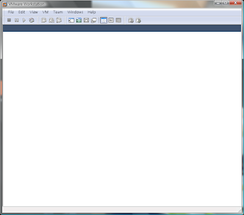

File > New > Virtual Machine

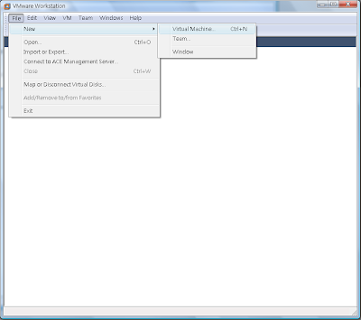

選擇 Typical

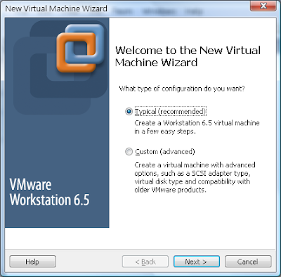

如果有 ISO 就選 ISO，沒有的話，就放光碟片進去吧 (硬碟內的 ISO 會比較快)

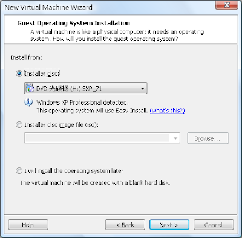

這邊是 VM 的快速設定，可以選擇不設定，正式安裝時在設定

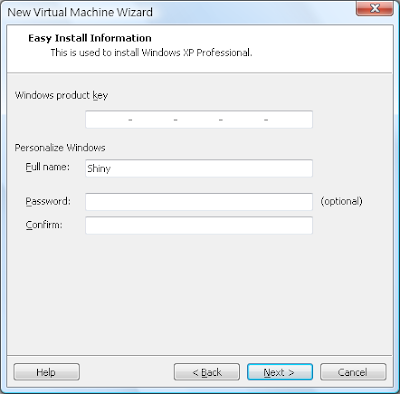

這邊是說，沒有輸入產品序號，之後在安裝的時候，會要求你要輸入

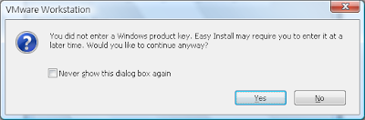

VM 的名稱和其儲存路徑

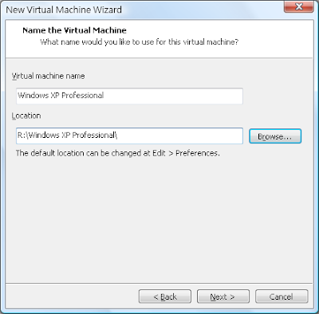

設定 VM 的硬碟容量，個人推薦如下：

- Windows XP 40G
- Windows Vista 80G
- 如有重度軟體需求(如 VS 2008、Adobe CS4 等)的，可以多個 10 ~ 20G

接下來會看到，VM 的參數，預設的當然不夠好，我們還需要進去修改一下

請點選 **Customize Hardware...**

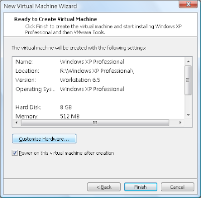

一開始進來，會看到記憶體大小的設定，請別傻傻的把自己所有記憶體都用下去

現在只是模你而已，所以夠用就好。
XP 個人建議 1G、VISTA 則是 2G (看個人硬體程度而定最少都要有建議的一半)

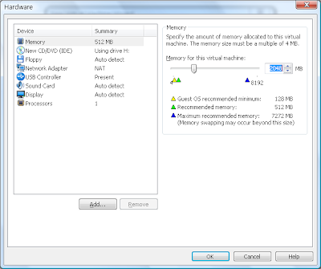

再來是虛擬網路卡，預設為 NAT，與本機共享網路

為了建構無毒的環境，所以請選擇 Bridged 這個就跟一般 PC 一樣要撥號才能上網

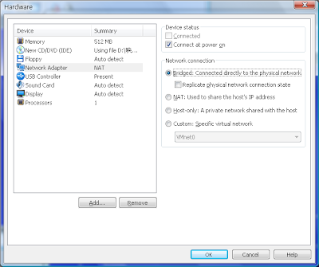

這邊選擇雙核心，理論上會比較快…

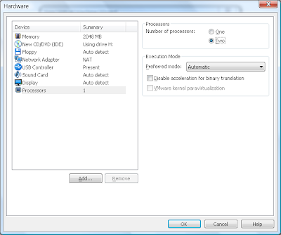

開始安裝 XP 囉

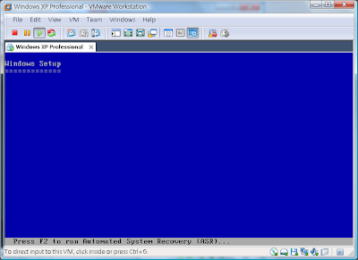

很快的進入視窗安裝畫面了

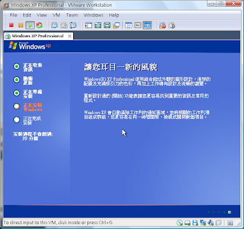

這邊要輸入產品序號，請打上自己的序號吧！

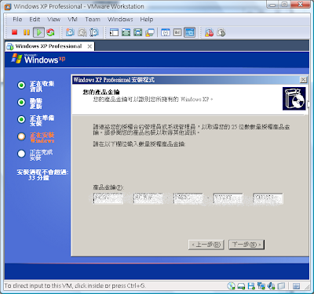

下面兩張是 [Acronis True Image Echo Server](http://www.ahasoft.com.tw/acronis/ESD/ati_svr.htm) 和 [Acronis Universal Restore](http://www.acronis.com.tw/enterprise/products/ATIESWin/universal-restore.html) 的官方介紹

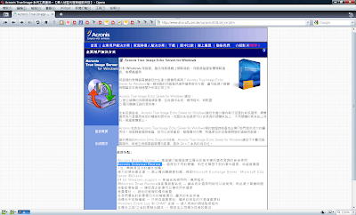

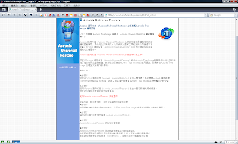

很快的我們環境都灌好了，自己要用的軟體也都用好了。

打開 [Acronis True Image](http://www.ahasoft.com.tw/acronis/ESD/ati_svr.htm) 選擇 Backup

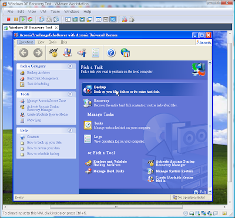

下一步，我也看不懂它說啥 XD

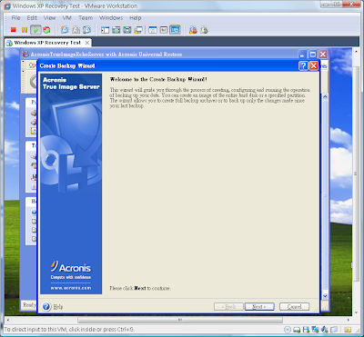

選擇整個電腦

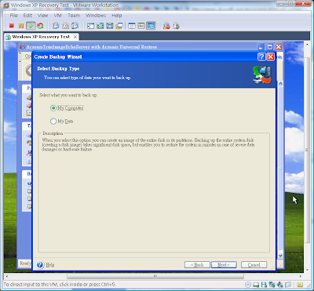

選擇全部磁區

不勾選任何例外

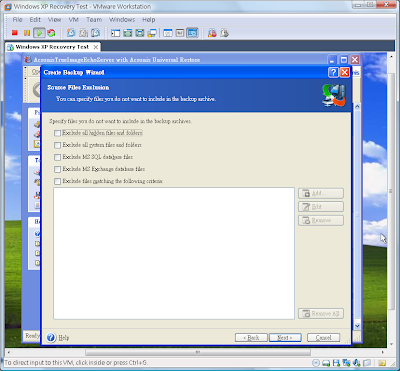

跳過，這不重要

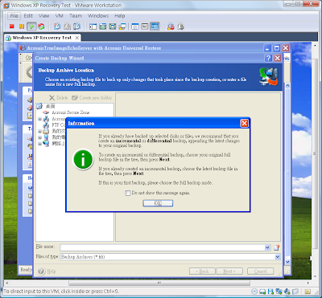

儲存在自己的本機，不是 VM 裡面喔！也可以儲存在隨身碟裡面。

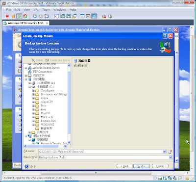

創造一個全新的

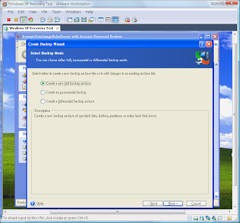

不使用預設。

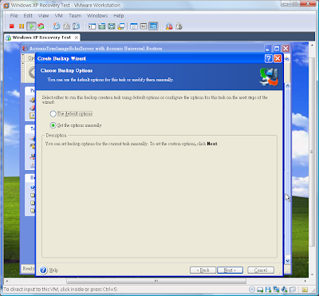

這邊是壓縮率最高到 65%

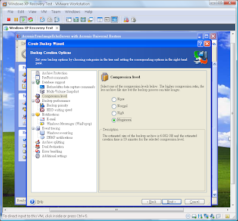

這邊可選擇要不要切割，依自己需求而定。

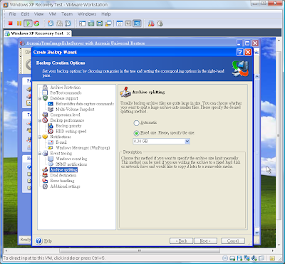

備份檔的描述，可不打。

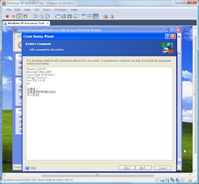

最後確認。

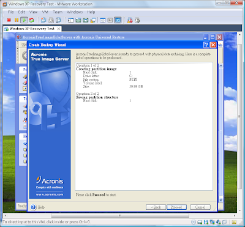

開始備份。

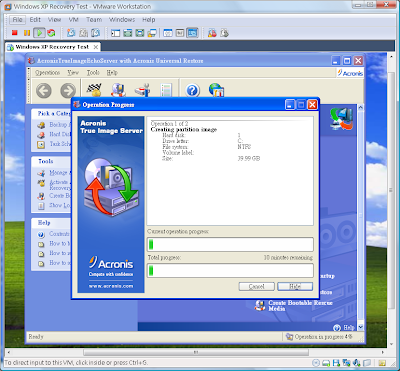

備份成功。

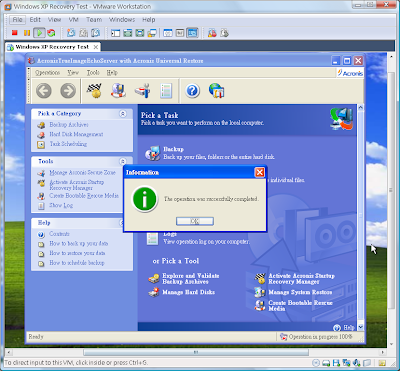

備份好還沒結束，還要創造一個 Acronis Universal Restore For True Image Echo Server 可開機光碟 ISO 檔。

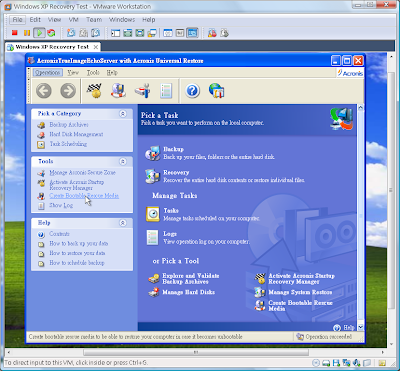

下一步

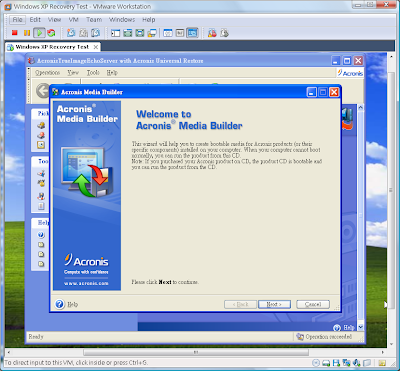

選擇 **Acronis Universal Restore For True Image Echo Server FULLLY**

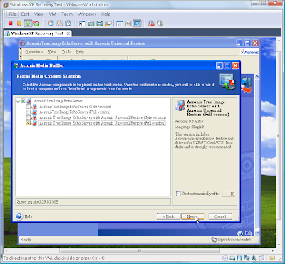

ISO 檔就好未來還要合併。

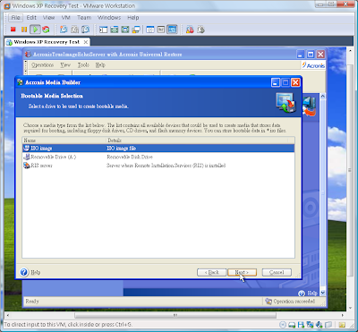

儲存位置，一樣是本機 或是 隨身碟

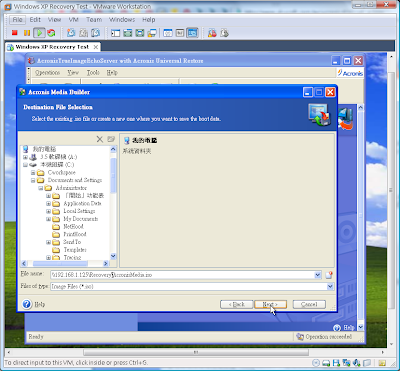

確認

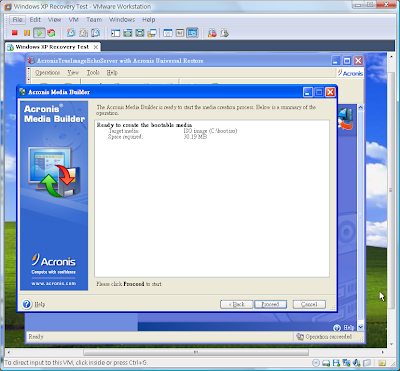

開始建立。

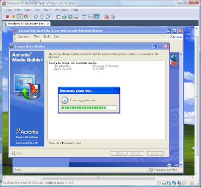

建立成功。

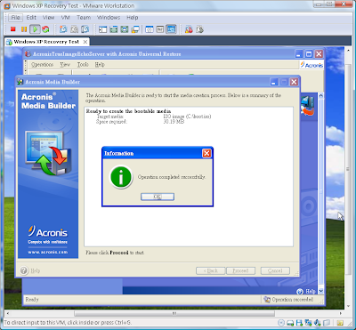

回到本機開啟 UltraISO，創造一個可開機 CD/DVD 映像檔

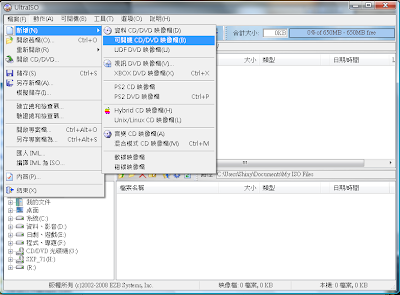

或是用開啟舊檔也可以(開啟可開機的 ISO 檔)。

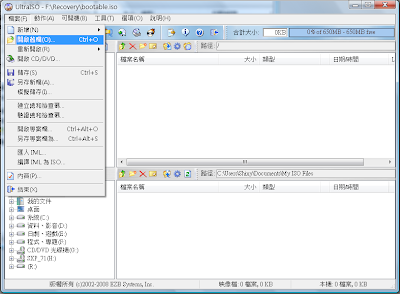

bootable.iso 就是剛剛所創立的

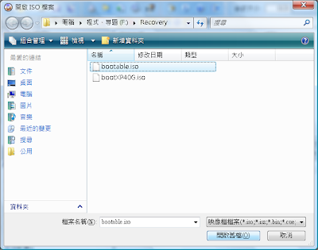

開啟之後，再插入檔案，要插入的是我們所備份出來的檔案

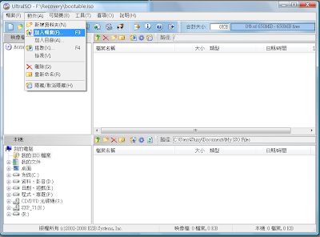

附檔名為 \*.tlb，單檔超過 4GB 需要改成 UDF DVD 格式

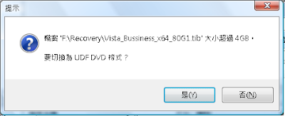

我們可以在選擇內容

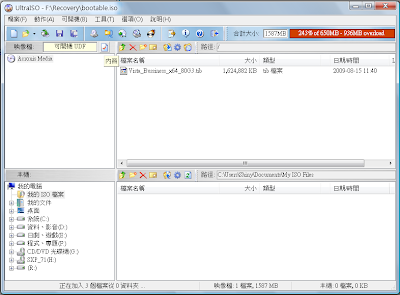

會出現下面視窗，勾選 UDF

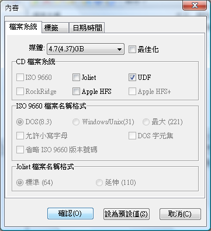

最後另存成一個可開機 ISO 檔

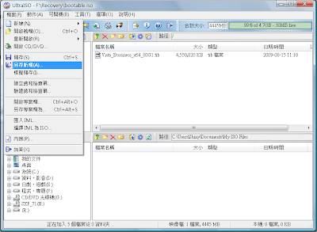

儲存好之後，就可以燒錄成光碟了，再燒錄之前，可以先用 VM 灌一次看看有沒有成功唷。

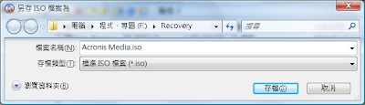

因為有重打一次，奇摩子比較不好一點點，所以敘述很短，不過看圖說故事，相信難度不會恨高的！

還原篇，再等一下子吧…
