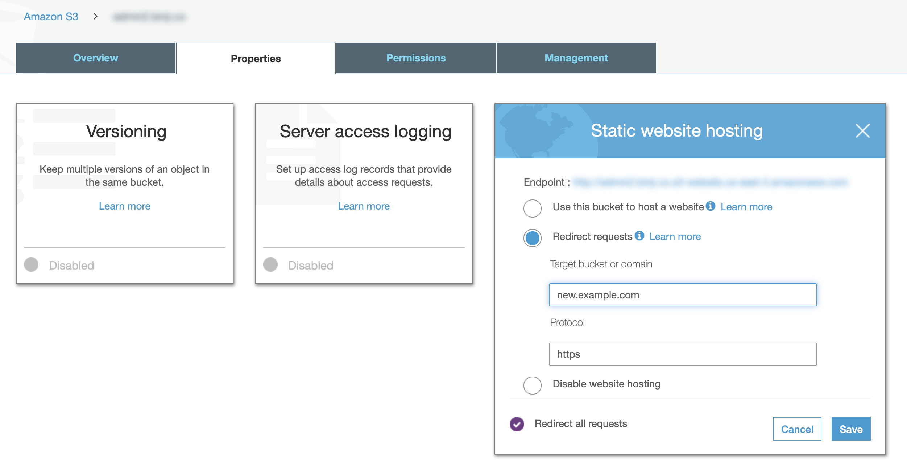
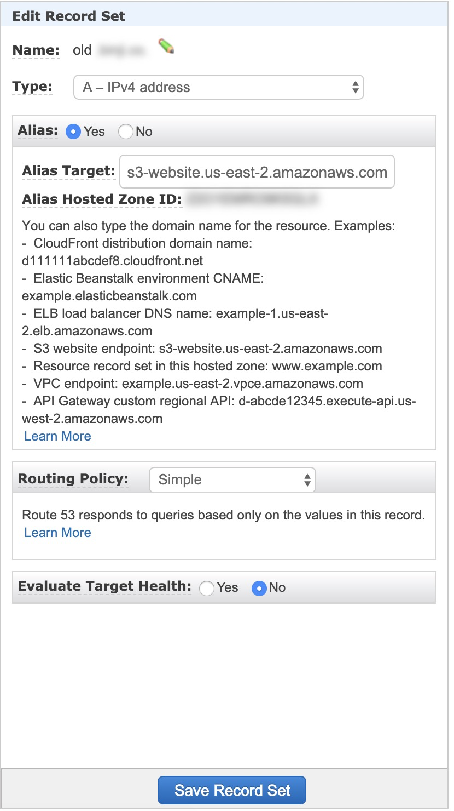

First, you have to create an s3 bucket which name is your old domain (e.g. old.example.com)and enter bucket and choose “Properties” > “Static website hosting”

Then, enter your old domain (e.g. old.example.com) and protocol correctly.

Enter the route53 service and modify old domain recordset and make sure your alias is yes and select the target to s3 which you just created as below image shows.

Once it has done, please wait for a few minutes and test it.
