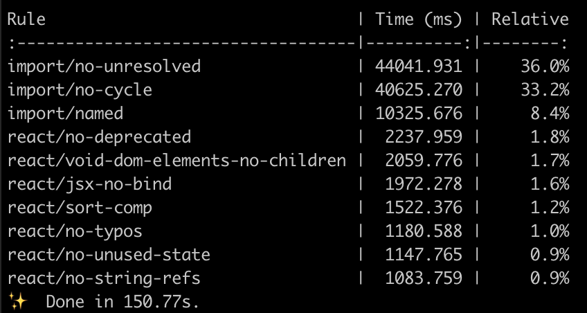
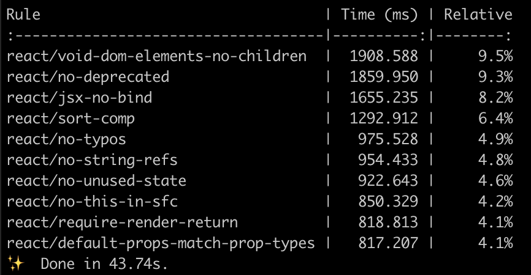
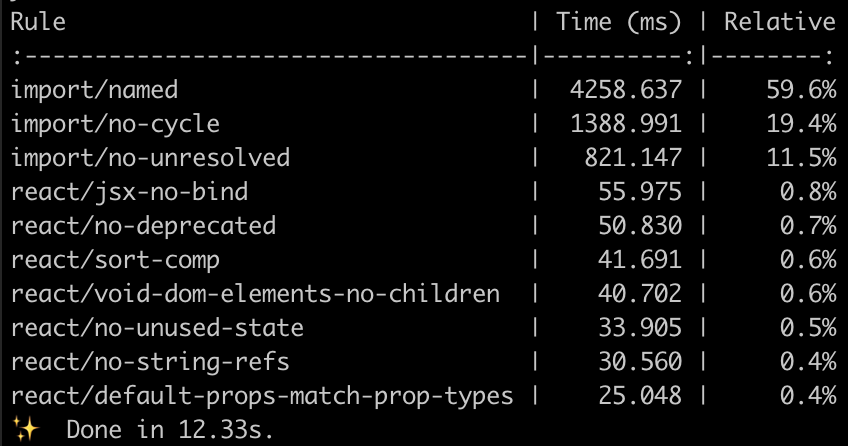
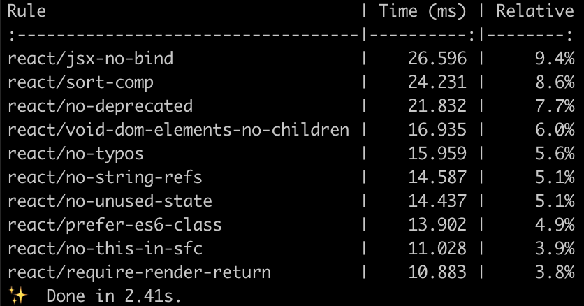
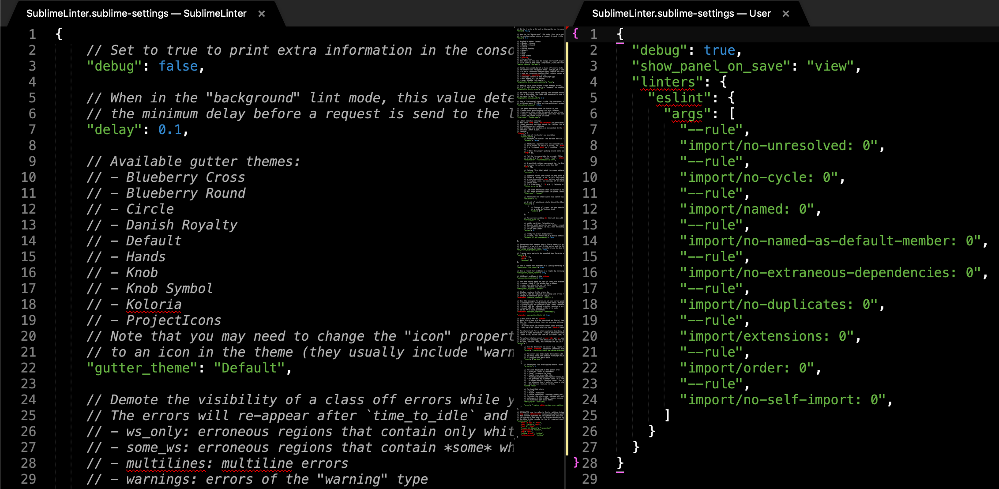

Most of the front-end engineers will extend Airbnb’s eslint-config-airbnb rules of their ESLint configuration. It’s a nice choice at the beginning, but you may have some performance issue when your project grows up.

You can export `TIMING=1` and execute ESLint to get per-rule performance report.

As below image shows, the most of time spent on `import` related rules.

_whole repo lint_

After we disabled the rules, the lint performance increased more than 3 times 🎉

_whole repo lint without import rule_

Can we just disable the rule in the `.eslintrc`🤔? No, you shouldn’t! Because the rule can make sure your code follows the standard or your team’s rules. Then, why I disable the rule in the IDE? Because most of the time spent on [static analytics](https://github.com/benmosher/eslint-plugin-import#static-analysis). Your code will not work at all if you import from the wrong path. That’s why I propose disable it in IDE. But please make sure you have CI run the lint otherwise your colleague will blame you 😅.

Below is a single file (~1k lines) lint performance comparison.

_single file_

As you can see, this is 6 times faster than the original.

_single file without import rule_

Let’s start setting up the IDE, you can choose “Sublime Text &gt; Preferences &gt; Package Settings &gt; SublimeLinter &gt; Settings”

Then Sublime will open the new window with two split panels, the left one is default settings with comments and the right one is user settings.

Once you saved, Sublime will reload the settings. So you can test the performance difference right away. Below is the source of settings, you can just copy and paste it.

Hope you enjoy this article, feel free to leave your comment at below. For more Sublime Text pro tips please see [Why I still using Sublime Text in 2019](https://medium.com/@shinychang/why-i-still-using-sublime-text-in-2019-75a02dcfa1b4).
