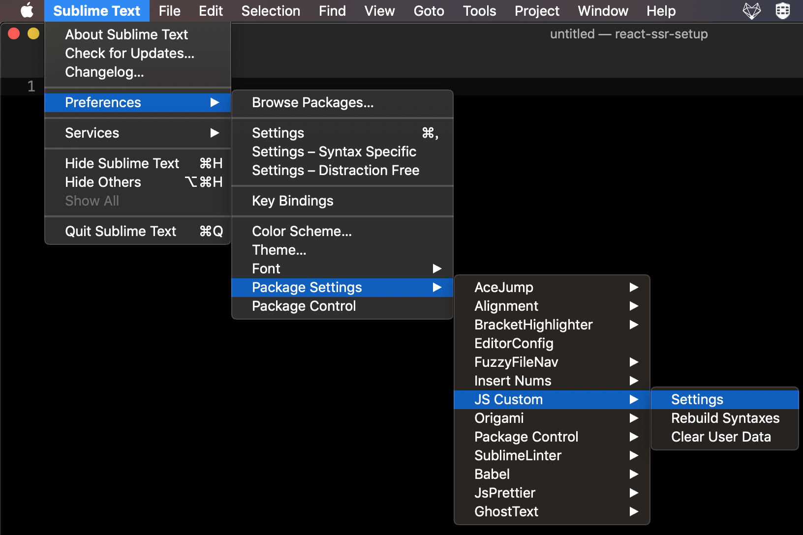
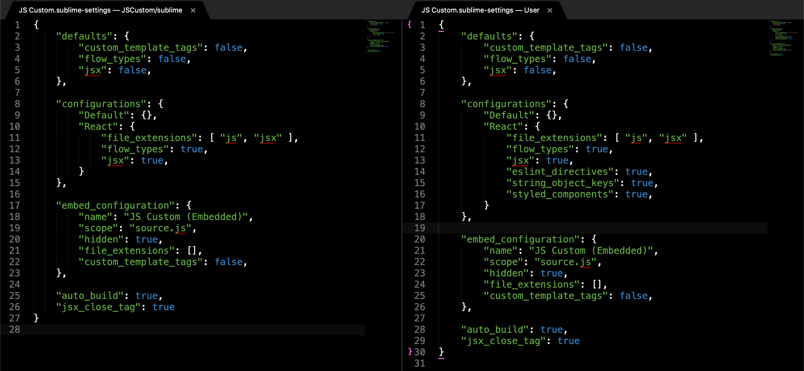
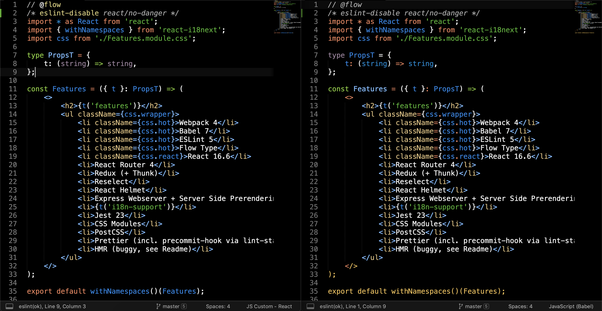
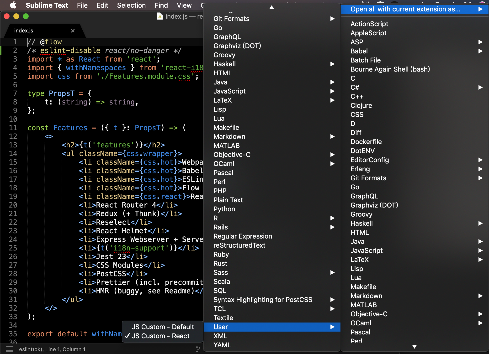

The most famous syntax highlight package for ECMAScript is babel and the last modified date is 2 Jan 2016…but now is 2019 🤦‍♂. It’s time to find the new package for modern ECMAScript.

Today, I will introduce [Sublime-JS-Custom](https://github.com/Thom1729/Sublime-JS-Custom), you can install via [Package Control](https://packagecontrol.io/installation) and search`JSCustom` and install it.

After installed, you can choose “Sublime Text &gt; Preferences &gt; Package Settings &gt; JS Custom &gt; Settings” to set user settings.



The left panel is default setting and the right panel is user setting, as you can see I enabled the most of the syntax. For more details, please refer to [Configuration](https://github.com/Thom1729/Sublime-JS-Custom#configuration).



```json
{
  "defaults": {
    "custom_template_tags": false,
    "flow_types": false,
    "jsx": false
  },

  "configurations": {
    "Default": {},
    "React": {
      "file_extensions": ["js", "jsx"],
      "flow_types": true,
      "jsx": true,
      "eslint_directives": true,
      "string_object_keys": true,
      "styled_components": true
    }
  },

  "embed_configuration": {
    "name": "JS Custom (Embedded)",
    "scope": "source.js",
    "hidden": true,
    "file_extensions": [],
    "custom_template_tags": false
  },

  "auto_build": true,
  "jsx_close_tag": true
}
```

And here is the comparison of JS Custom — React and JavaScript (Babel), the `flow` and `eslint-disable` be highlighted and it also supports Fragment.

_left: JS Custom — React / right: JavaScript (Babel)_

If you want to set some file extension (`.js`, `jsx`) with custom syntax automatically, you can press the right bottom of the window and then choose “Open all with current extension as… &gt; User &gt; JS Custom — React”



If you want to highlight [custom template tags](https://github.com/Thom1729/Sublime-JS-Custom#custom_template_tags-object) feature please set `custom_template_tags: true` and then enjoy the feature.
