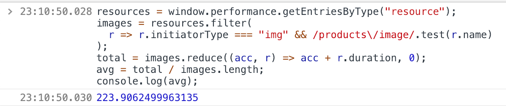

Many of you may know how to measure your site loading speed. For example, you can use chrome devtools' performance, lighthouse or GTmetrix. What if you have to measure some specified resources loading speed, what will you do?

First, you can use chrome devtools and choose “Network” panel and apply some filter (e.g. domain filter or keyword filter) to measure the loading speed.


Second, you can use [Performance API](https://developer.mozilla.org/en-US/docs/Web/API/Performance) to get the raw data of page load information. Then you can use `getEntriesByType("resources")` to get resources’ information (array of [PerformanceEntry](https://developer.mozilla.org/en-US/docs/Web/API/PerformanceEntry)). PerformanceEntry contains `name`, `entryType`, `startTime` and `duration`.

For example, I have to measure the average of product image loading speed which URL pathname contains `/products/image/`. I can write below script and paste and exec it in the console.

```javascript
resources = window.performance.getEntriesByType("resource")
images = resources.filter(
  r => r.initiatorType === "img" && /products\/image/.test(r.name)
)
total = images.reduce((acc, r) => acc + r.duration, 0)
avg = total / images.length
console.log(avg)
```

As you can see, the average product image loading speed is 223.9ms.


