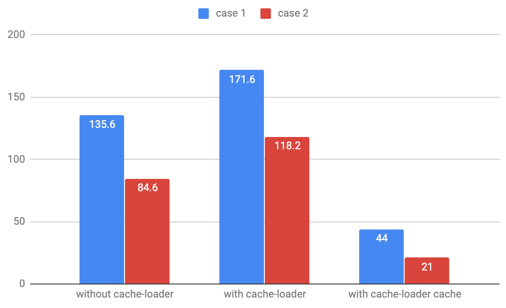
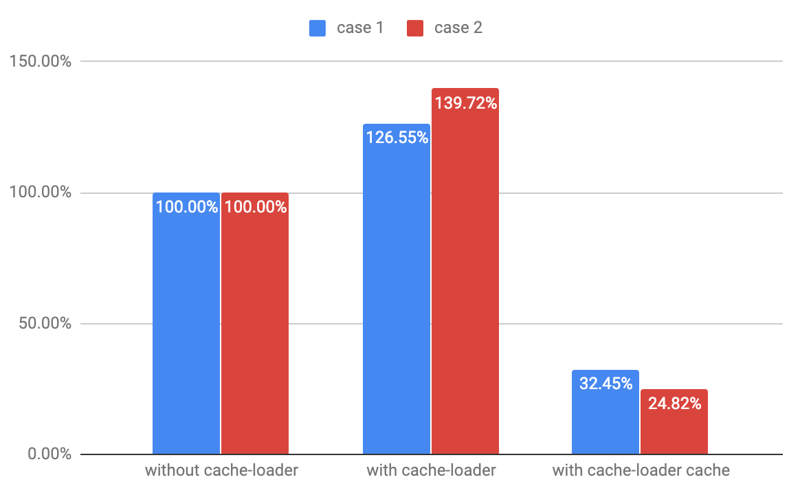

繼上一篇 thread-loader 可以減少 build time 27% 之後，繼續來講 build time 最佳化的部分，說到 cache，在 web 的世界真的是百百種…這邊就不多說了，還是回到主題 webpack 上面。這次的 cache-loader 可以減少最多 75% 的時間。

今天要講的主角 [cache-loader](https://github.com/webpack-contrib/cache-loader) 跟 thread-loader 一樣都是好棒棒的 loader，都只需要一行就可以幫你加速，如同官方的說明，只需要放在 babel-loader 的前面就可以了。

```javascript
module.exports = {
  module: {
    rules: [
      {
        test: /\.js$/,
        use: ["cache-loader", "babel-loader"],
        include: path.resolve("src"),
      },
    ],
  },
}
```

完成後在執行 webpack build 以後會發現在根目錄下會多出 **.cache-loader** 這個資料夾，這就是 cache-loader 的 cache 存放的地方，記得要加入 .gitignore 中。

因為要寫入檔案到硬碟上，所以第一次的 build 會比原本還要多花一些時間，但是第二次 build 就會減少非常多的時間，相關數據如下圖：





只要加入一行，就可以減少最多 75% 的 build time，是不是很吸引人呢！

最後，如果 thread-loader 和 cache-loader 兩個要一起使用的話，請先放 cache-loader 接著是 thread-loader 最後才是 heavy-loader，這樣的順序才可以有最好的效能。
