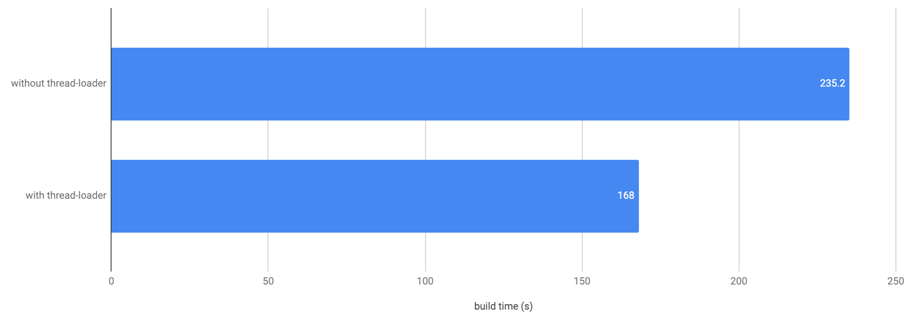

近期一直在與 webpack 打交道，原因不外乎是為了更好的開發體驗與使用者體驗。webpack 設定之複雜實在是為人之所詬病，不過在 parcel 出現後所帶動的 zero config 風潮，webpack 在 v4 也大幅的改進這一部分。但是 zero config 終究只是個入門選項，當要開始各種最佳化或是引入 loaders/plugins 的時候，自己撰寫 webpack.config.js 將會是必須的。

[thread-loader](https://github.com/webpack-contrib/thread-loader) 是一個可以大幅減少 build time 的一個 loader，實際上使用也非常的簡單，最基本的設定如下：

```javascript
module.exports = {
  ...
  module: {
    rules: [
      {
        test: /\.js$/,
        exclude: /node_modules/,
        use: [
          'thread-loader',
          'babel-loader'
        ]
      },
      ...
    ]
    ...
  }
  ...
}
```

只需要在 heavy-loader 之前放上 thread-loader 就可以了，怎樣算是 heavy-loader 呢？可以使用 [Speed Measure Plugin](https://github.com/stephencookdev/speed-measure-webpack-plugin) 來看到底哪個 loader 花了你最多時間。不意外的話會是 babel-loader 和 css-loader 兩個！那麼可以用一樣的方式，在 css-loader 前面放上 thread-loader

```javascript
module.exports = {
  ...
  module: {
    rules: [
      {
        test: /\.js$/,
        exclude: /node_modules/,
        use: [
          'thread-loader',
          'babel-loader'
        ]
      },
      {
        test: /\.s?css$/,
        exclude: /node_modules/,
        use: [
          'style-loader',
          'thread-loader',
          {
            loader: 'css-loader',
            options: {
              modules: true,
              localIdentName: '[name]__[local]--[hash:base64:5]',
              importLoaders: 1
            }
          },
          'postcss-loader'
        ]
      }
      ...
    ]
    ...
  }
  ...
}

```

請注意，不可以放在 style-loader 的前面，因為 thread-loader 沒辦法存取檔案也沒辦法讀取 webpack 的設定。

因為開 worker 會有一些 overhead，根據官方說法每個 worker 大概花費 600ms，所以官方也提供了優化的方式：

```javascript
const threadLoader = require("thread-loader")

threadLoader.warmup(
  {
    // pool options, like passed to loader options
    // must match loader options to boot the correct pool
  },
  [
    // modules to load
    // can be any module, i. e.
    "babel-loader",
    "babel-preset-es2015",
    "sass-loader",
  ]
)
```

第一個參數是 thread-loader 的 options，第二個是需要 warmup 的 modules，通常會放上 loaders，實際上任何的 node module 都可以，設定如下：

```javascript
...
const threadLoader = require('thread-loader');

const jsWorkerPool = {
  poolTimeout: 2000
};

const cssWorkerPool = {
  workerParallelJobs: 2,
  poolTimeout: 2000
};

threadLoader.warmup(jsWorkerPool, ['babel-loader']);
threadLoader.warmup(cssWorkerPool, ['css-loader', 'postcss-loader']);


module.exports = {
  ...
  module: {
    rules: [
      {
        test: /\.js$/,
        exclude: /node_modules/,
        use: [
          {
            loader: 'thread-loader',
            options: jsWorkerPool
          },
          'babel-loader'
        ]
      },
      {
        test: /\.s?css$/,
        exclude: /node_modules/,
        use: [
          'style-loader',
          {
            loader: 'thread-loader',
            options: cssWorkerPool
          },
          {
            loader: 'css-loader',
            options: {
              modules: true,
              localIdentName: '[name]__[local]--[hash:base64:5]',
              importLoaders: 1
            }
          },
          'postcss-loader'
        ]
      }
      ...
    ]
    ...
  }
  ...
}
```

因為加入了 thread-loader 在既有的專案，讓整個 build time 從 3.92 分鐘減少到了 2.8 分鐘，大約減少了 27% 的時間，因此這是一個非常值得投資的修改！

_Reduced 27% build time_

最後，如果有用 sass-loader 的人可能會踩到 node-sass 的一個雷，因為 node-sass 裡面也有 multiple thread 的功能，為了要避開這個問題，需要把 css 的 worker pool 中的 workerParallelJobs 設定為 2 才可以正常的 build 完成。

最最後，如果有 watch 的需求，可以把 poolTimeout 設定為 Infinity 好讓 pool 可以一直存在，以增進 incremental build 的效率。
