I have been used [Sublime Text](https://www.sublimetext.com/) in MacOS and Windows for over 6 years, which still is a fantastic editor even in 2019. In the past years, I tried lots of famous IDEs ([Atom](https://atom.io/), [VSCode](https://code.visualstudio.com/), and [WebStorm](https://www.jetbrains.com/webstorm/)), none of suitable with me. I will introduce some advanced skills of Sublime Text and why I choose it in this post.

## Pro Tips

### Goto Definition… (F12)

Sublime Text’s Goto Definition is faster than other IDEs, which does not only jump to the same file but also jump to other files.

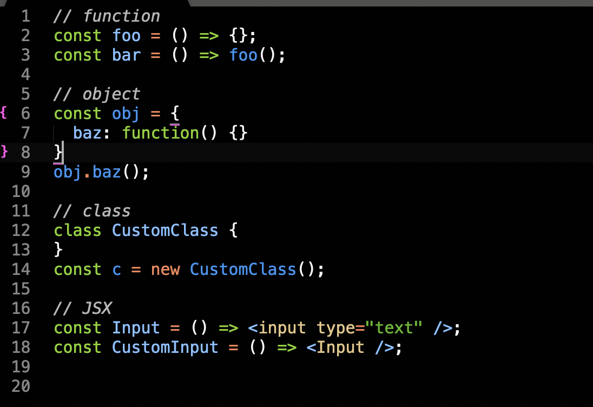_Put your cursor on the target and press **F12** will go to definition_

### Goto Symbol in Project (Cmd + Shift + R)

This is useful when you remember the Symbol (class/function/property) but not actually know where is it. First, you have to “Cmd + Shift + R”, second you have to type keywords.

_Press “Cmd + Shift + R” and the type keywords to search_

If you are filtering the method/property it will have the second filter for you jumping between files. (just like “Cmd + P” with scope)

### Project

Most of the people do not use **project** feature when using Sublime Text. This is very important if you have to context switch between projects. You can create a project by drag-drop folder or “Project &gt; Add folder to Project”, then “Project &gt; Save Project As…”.

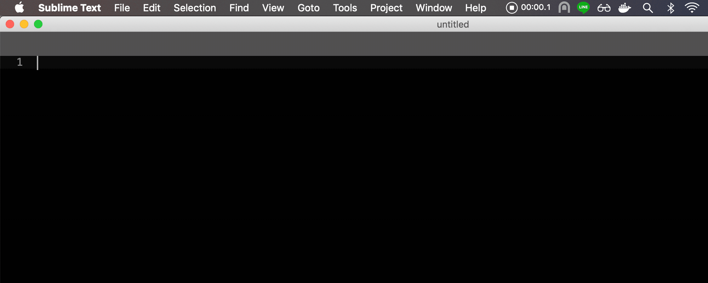_Add folder to project_

You can press “Cmd + Ctrl + P” to switch project in seconds.

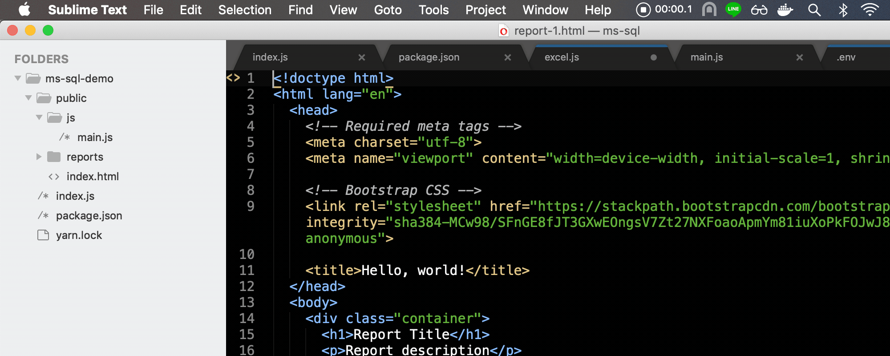_Switch project by press “Cmd + Ctrl + P” and type keywords_

### Paste from history (Cmd + K + V)

Sublime will remember your clipboard history, this is very useful if you are doing some heavy copy-paste task.

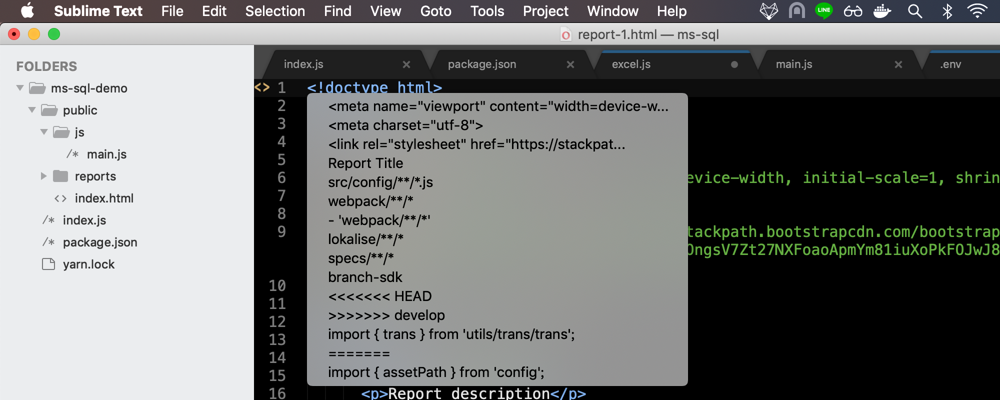_Press “Cmd + K + V” can preview the clipboard from history_

### Paste and indent (Cmd + Shift + V)

Remember this can save time because you don’t spend the time to indent after pasting. You can keep focusing on what you want to do.

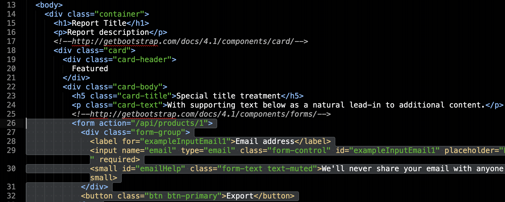_Press “Cmd + Shift + V” can paste with indent_

### Rember your syntax

Sometimes you may have some custom file extension (e.g. _jsx)_. Or you’d like to enhance the syntax (e.g. from* JavaScript* into _JavaScript (babel)_). The current syntax will display at the right bottom of the status bar.

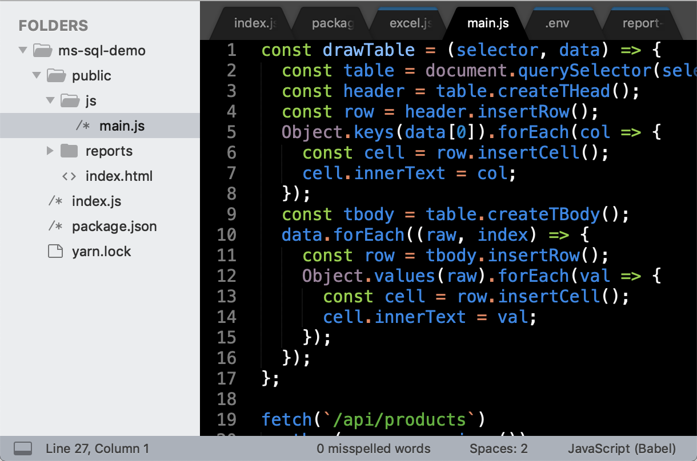_JavaScript (Babel) is the current syntax_

You can press it and choose “Open all with current extension as…” and then pick what you want. After that, sublime will set the syntax what you pick when you open the same extension of the file next time.

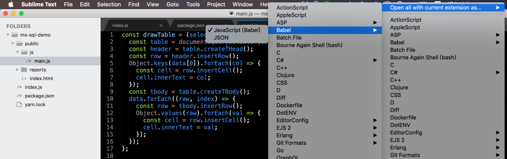

### Soft undo (Cmd + U)

Undo required the change of the file, soft undo does not require. Sublime will remember your cursor change in the background. Sometimes you may need press F12 to see the detail of function and then back to original position.

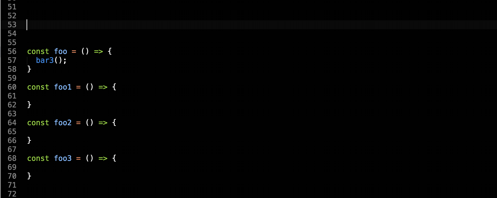

### Select all matched of current selection (Cmd + Ctrl + G)

Press “Cmd + D” can select next matched of the current selection. What if you have to select all matched? Maybe you will press “Cmd + D” until all selected. It’s okay lah because there was no big difference. It just like paste with indent, can save you time.

What if some of the match I don’t want to change? No problem! You can press “Cmd + K + D” to skip current selection and select next match.

### Split into lines (Cmd + Shift + L)

It’s super useful for string manipulation. First, you have to select multiple lines. Second, press “Cmd + Shift + L” to change the cursor from 1 to many.

### Don’t Save (Cmd + D)

“Enter” will save the file, “Esc” will cancel the action, “Cmd + D” will close without saving.

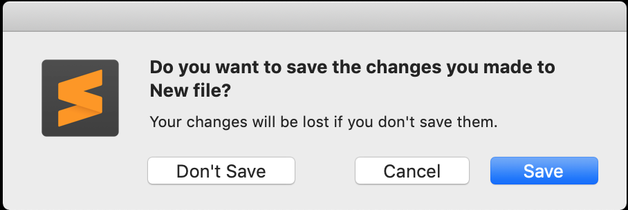

### Save all (Ctrl + Alt + Shift + S)

I have to say this is the one of hardest shortcut in sublime. It’s useful after you replaced strings across files.

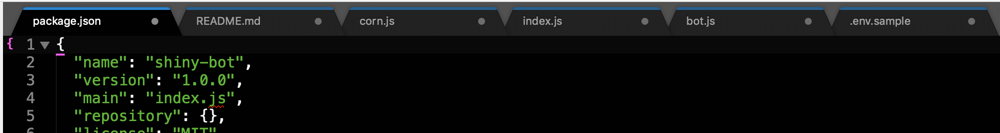

If it’s too hard for you, please remember you can choose from the toolbar

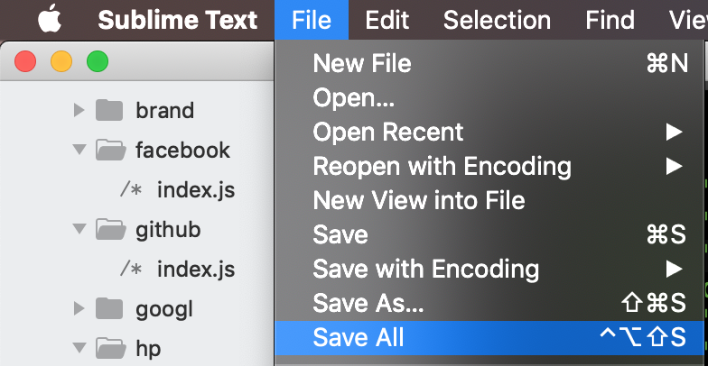

Above pro tips all are native support of sublime. I’m not listing down all the tips in this post because there are too many. But you can ask any questions in this post and I will reply it. As same as other IDEs, sublime also can install extensions (package) to enhance it. This will be another part.

## Why I choose Sublime Text?

First is because of **speed**, open sublime usually immediately. Other IDEs usually took a few seconds. Maybe you will think this is unfair, IDE does lots of things in the background causing the boot time increased. But, Sublime can do almost all the things what frontend engineer needs. So I think this is fair.

Second is because of **shortcut**, I already master in the sublime. Switching to other IDEs (e.g. VSCode) is a big challenge. Of course, there has some extension for key-mapping, but still cannot 100% cover.

Sublime is perfect? No, it doesn’t! I will choose IDE if I have to code with some compile required language (e.g. flutter). Also, sublime does not natively support console and git.
