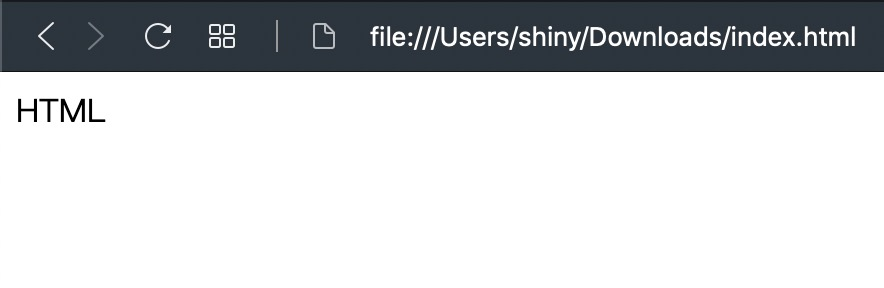

一分鐘學前端是給網頁初學者或是對網頁感興趣的人所設計的，重點在於可以立刻的感受到成就感。

因為是第一篇，所以要介紹前端最重要的根本：HTML，HTML 是一種標記語言，就當作是一種文字吧，只是他需要是成對的

有開始就要有結束，就跟做人一樣要有始有終，有興趣的可以看下面的程式碼

```html
<!DOCTYPE html>
<html>
  <head></head>
  <body>HTML</body>
</html>
```

恩，完全沒有感覺對吧！

<a href="data:text/text;base64,PCFET0NUWVBFIGh0bWw+CjxodG1sPgogIDxoZWFkPjwvaGVhZD4KICA8Ym9keT5IVE1MPC9ib2R5Pgo8L2h0bWw+" download="index.html">下載我的第一個網頁 HTML</a>，然後在下載的資料夾裡面點兩下打開他，你就寫好了第一個網頁了！(如下圖)



有興趣的話可以用記事本或是其他的文字編輯器打開，並且修改 `HTML` 成其他的文字，然後在按下 F5 重新整理網頁，就可以看到修改後的內容了
