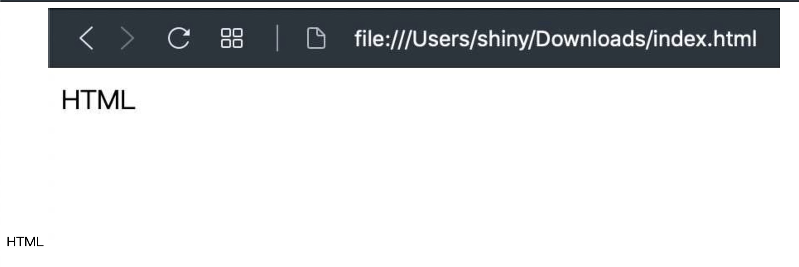

圖片是網頁重要的元素之一，可以讓你的網頁變得非常豐富，就如同 [第一篇文章](https://shinychang.net/blog/一分鐘學前端-1-第一個-HTML/) 我的截圖一樣，可以先看到最後的成果，在了解怎麼達成的，要加入圖片在網頁中很簡單，完整的程式碼如下：

```html
<!DOCTYPE html>
<html>
  <head></head>
  <body>
    HTML
    
  </body>
</html>
```

可以看到我只有增加了一行

```html

```

<a href="data:text/text;base64,PCFET0NUWVBFIGh0bWw+CjxodG1sPgogIDxoZWFkPjwvaGVhZD4KICA8Ym9keT4KICAgIEhUTUwKICAgIDxpbWcgc3JjPSJodHRwczovL3NoaW55Y2hhbmcubmV0L3N0YXRpYy80YjAxZjZmMzBkNzQ4OGEyNTc1NWE3MWNhN2QwNmIwMy8wZjdjNS9DbGVhblNob3QlMjAyMDE5LTEwLTA1JTIwYXQlMjAxOS4wOS41MiU0MDJ4LmpwZyIgLz4KICA8L2JvZHk+CjwvaHRtbD4=" download="index.html">下載我的第二個網頁 HTML</a>，然後在下載的資料夾裡面點兩下打開他，你就寫好了有圖有文的網頁了！(如下圖)



前一篇文章說到的標記正確的名詞是標籤（Tag），大多數得標籤需要是成對的，有開始有結束，但是少數標籤是不需要在開始與結束中間加入任何內容的，譬如說這次介紹的 `` 是屬於自我封閉（self-closing）的標籤。

另外也看到了新的寫法在 HTML 標籤上，格式如下

```jsx
<Tag attribute="value" />
```

- **Tag** 就像是 `html`, `body` 和 `img` 這類型的
- **attribute** 就像是 `src`
- **value** 就像是 `https://shinychang.net/static/4b01f6f30d7488a25755a71ca7d06b03/0f7c5/CleanShot%202019-10-05%20at%2019.09.52%402x.jpg`

每種標籤（Tag）都會有不同的屬性（attribute）可以設定，不過已經超出這次的範圍了，未來會在介紹一些常用的標籤以及屬性
