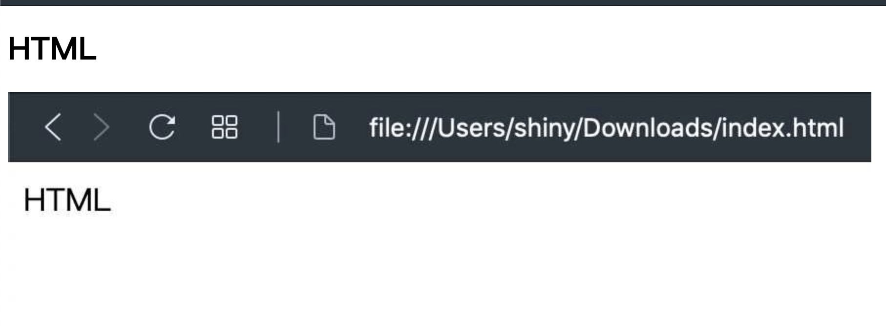

在 [上一篇文章](https://shinychang.net/blog/一分鐘學前端-1-第一個-HTML/) 加入了圖片，結果圖片很大，文字很小，看起來頗不協調，所以接下來要把文字加大，完整程式碼如下：

```html
<!DOCTYPE html>
<html>
  <head></head>
  <body>
    <h1>HTML</h1>
    
  </body>
</html>
```

可以看到只是把 HTML 四個文字放在 `<h1>` 和 `</h1>` 的裡面，前者就是開始標籤，後者是結束標籤，就可以把文字變大了

```html
<h1>HTML</h1>
```

<a href="data:text/text;base64,PCFET0NUWVBFIGh0bWw+CjxodG1sPgogIDxoZWFkPjwvaGVhZD4KICA8Ym9keT4KICAgIDxoMT5IVE1MPC9oMT4KICAgIDxpbWcgc3JjPSJodHRwczovL3NoaW55Y2hhbmcubmV0L3N0YXRpYy80YjAxZjZmMzBkNzQ4OGEyNTc1NWE3MWNhN2QwNmIwMy8wZjdjNS9DbGVhblNob3QlMjAyMDE5LTEwLTA1JTIwYXQlMjAxOS4wOS41MiU0MDJ4LmpwZyIgLz4KICA8L2JvZHk+CjwvaHRtbD4=" download="index.html">下載 HTML</a>，然後在下載的資料夾裡面點兩下打開，就可以看到下圖的內容



除了 `h1` 之外其實還有很多可以調整文字大小的標籤：

- h1
- h2
- h3
- h4
- h5
- h6
- small

其中 `h1` ~ `h6` 是代表標題（header）一到標題六，提供了各種不同大小的文字，而 `small` 是讓文字比目前大小在小一點點，所以可以組合成：

```html
<h1>HT<small>ML</small></h1>
```
