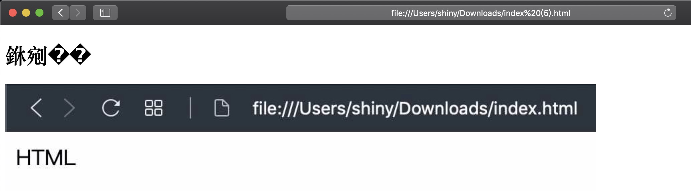
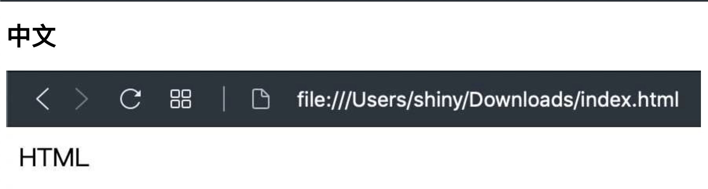

前面幾篇都是介紹英文的內容，是時候進入多語言的情況了，畢竟除了英文以外還會中文嘛！就改改 `HTML` 變成 `中文` 吧！

```html
<!DOCTYPE html>
<html>
  <head></head>
  <body>
    <h1>中文</h1>
    
  </body>
</html>
```

<a href="data:text/text;base64,PCFET0NUWVBFIGh0bWw+CjxodG1sPgogIDxoZWFkPjwvaGVhZD4KICA8Ym9keT4KICAgIDxoMT7kuK3mloc8L2gxPgogICAgPGltZyBzcmM9Imh0dHBzOi8vc2hpbnljaGFuZy5uZXQvc3RhdGljLzRiMDFmNmYzMGQ3NDg4YTI1NzU1YTcxY2E3ZDA2YjAzLzBmN2M1L0NsZWFuU2hvdCUyMDIwMTktMTAtMDUlMjBhdCUyMDE5LjA5LjUyJTQwMnguanBnIiAvPgogIDwvYm9keT4KPC9odG1sPg==" download="index.html">下載 HTML</a>，然後在下載的資料夾裡面點兩下打開，就可以看到下圖的內容




> 如果你是 Chrome 的使用者的話，也許還是會出現 **中文** ，而不是 **銝剜** 這種亂碼，這是因為 Chrome 已經強大到可以自動判斷正確編碼了

為了解決編碼，你需要在 `head` 裡面加入以下內容：

```html
<meta charSet="utf-8"/>
```

來讓瀏覽器知道是用 UTF-8 的編碼方式，所謂的 UTF-8 就是一種國際編碼原則，把各種文字給予一個編碼，就類似ㄅㄆㄇㄈ這樣的東西都會給他一個編號

切記一定要放在 `<head>` 的後面，放在所有其他文字的前面，不然在這個標籤之前的文字還是亂碼唷！

```html
<!DOCTYPE html>
<html>
  <head>
    <meta charSet="utf-8" />
  </head>
  <body>
    <h1>中文</h1>
    
  </body>
</html>
```


<a href="data:text/text;base64,PCFET0NUWVBFIGh0bWw+CjxodG1sPgogIDxoZWFkPgogICAgPG1ldGEgY2hhclNldD0idXRmLTgiIC8+CiAgPC9oZWFkPgogIDxib2R5PgogICAgPGgxPuS4reaWhzwvaDE+CiAgICA8aW1nIHNyYz0iaHR0cHM6Ly9zaGlueWNoYW5nLm5ldC9zdGF0aWMvNGIwMWY2ZjMwZDc0ODhhMjU3NTVhNzFjYTdkMDZiMDMvMGY3YzUvQ2xlYW5TaG90JTIwMjAxOS0xMC0wNSUyMGF0JTIwMTkuMDkuNTIlNDAyeC5qcGciIC8+CiAgPC9ib2R5Pgo8L2h0bWw+Cg==" download="index.html">下載正確的 HTML</a>，然後在下載的資料夾裡面點兩下打開，就可以看到下圖的內容


