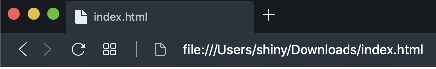
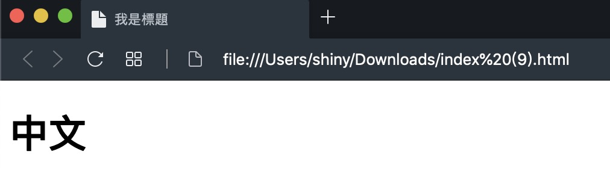

前面幾篇都是介紹網頁內容的部分，只有上一篇介紹了解決多國語言亂碼的問題，不知道有沒有注意到瀏覽器頁籤的內容是顯示 `index.html` 也就是檔案的名稱呢？



要解決這問題只需要把想要的標題文字放在標題標籤（`title`）裡面並解放在 `<head>` 與 `</head>` 之間就可以了，但是切記要放在[上一篇文章](https://shinychang.net/blog/一分鐘學前端-4-銝剜-中文亂碼/)介紹過的內容的後面

```html
<!DOCTYPE html>
<html>
  <head>
    <meta charset="utf-8" />
    <title>我是標題</title>
  </head>
  <body>
    <h1>中文</h1>
  </body>
</html>
```

<a href="data:text/text;base64,PCFET0NUWVBFIGh0bWw+CjxodG1sPgogIDxoZWFkPgogICAgPG1ldGEgY2hhcnNldD0idXRmLTgiIC8+CiAgICA8dGl0bGU+5oiR5piv5qiZ6aGMPC90aXRsZT4KICA8L2hlYWQ+CiAgPGJvZHk+CiAgICA8aDE+5Lit5paHPC9oMT4KICA8L2JvZHk+CjwvaHRtbD4=" download="index.html">下載 HTML</a>，然後在下載的資料夾裡面點兩下打開，就可以看到下圖的內容



現在整個網頁的內容都可以自己控制囉！
