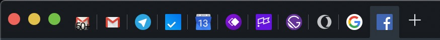
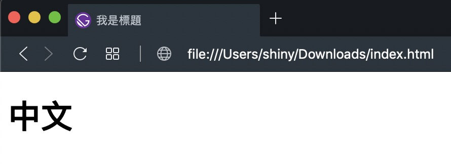

[上一篇](https://shinychang.net/blog/一分鐘學前端-5-網頁標題/)介紹了可以修改頁籤上顯示文字的方式，接著這篇就要介紹如何修改網頁的 icon ，有了 icon 就可以做出識別化，讓別人不需要看到名稱也可以知道是什麼網站，因此好的 icon 設計是非常重要的。



上面這張圖有認得幾個 icon 呢？是不是有些不需要文字就知道是什麼了呢？這就是 icon 好用的地方！

首先<a href="data:text/text;base64,PCFET0NUWVBFIGh0bWw+CjxodG1sPgogIDxoZWFkPgogICAgPG1ldGEgY2hhcnNldD0idXRmLTgiIC8+CiAgICA8dGl0bGU+5oiR5piv5qiZ6aGMPC90aXRsZT4KICAgIDxsaW5rIHJlbD0ic2hvcnRjdXQgaWNvbiIgaHJlZj0iaWNvbi00OHg0OC5wbmciIC8+CiAgPC9oZWFkPgogIDxib2R5PgogICAgPGgxPuS4reaWhzwvaDE+CiAgPC9ib2R5Pgo8L2h0bWw+" download="index.html">下載 HTML</a>，接著可以下載下面這張圖片：


並且存到跟 `index.html` 同一個目錄下緊接著打開 `index.html` 就可以看到左邊的 icon 變成剛剛下載的圖片了，結果如下圖：



最後附上完整的程式碼：

```html
<!DOCTYPE html>
<html>
  <head>
    <meta charset="utf-8" />
    <title>我是標題</title>
    <link rel="shortcut icon" href="icon-48x48.png" />
  </head>
  <body>
    <h1>中文</h1>
  </body>
</html>
```

主要是在 head 裡面加上了 `<link rel="shortcut icon" href="icon-48x48.png" />` 來跟瀏覽器說明 icon 要用哪個路徑，不一定要 48x48 的大小，現代瀏覽器會自動幫你縮小，方便很多！
