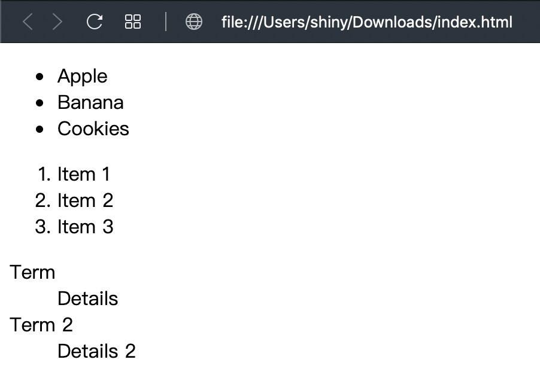

項目清單是非常實用的網頁元素，分別有

- `<ul>`: 無序清單 (unordered list)
    
  會顯示一個小黑點在項目的前面，通常用在沒有順序性的清單上

- `<ol>`: 有序清單 (ordered list)

  會顯示阿拉伯數字 (1, 2, 3, ...)，在項目的前面，通常用在有順序性的清單上

- `<dl>`: 定義描述清單 (description list)

  沒有額外顯示的內容，但是會把描述的名詞與說明分別顯示出來

其中 `<ol>` 和 `<ul>` 會用到 `<li>` (list item) 來當作清單的項目，而 `<dl>` 則是會用到 `<dt>` (description term) 和 `<dd>` (description details)，具體用法如下

```html
<ul>
  <li>Apple</li>
  <li>Banana</li>
  <li>Cookies</li>
</ul>
<ol>
  <li>Item 1</li>
  <li>Item 2</li>
  <li>Item 3</li>
</ol>
<dl>
  <dt>Term</dt>
  <dd>Details</dd>
  <dt>Term 2</dt>
  <dd>Details 2</dd>
</dl>
```

<a href="data:text/text;base64,PCFET0NUWVBFIGh0bWw+CjxodG1sPgogIDxoZWFkPgogICAgPG1ldGEgY2hhcnNldD0idXRmLTgiIC8+CiAgICA8dGl0bGU+5oiR5piv5qiZ6aGMPC90aXRsZT4KICAgIDxsaW5rIHJlbD0ic2hvcnRjdXQgaWNvbiIgaHJlZj0iaWNvbi00OHg0OC5wbmciIC8+CiAgPC9oZWFkPgogIDxib2R5PgogICAgPHVsPgogICAgICA8bGk+QXBwbGU8L2xpPgogICAgICA8bGk+QmFuYW5hPC9saT4KICAgICAgPGxpPkNvb2tpZXM8L2xpPgogICAgPC91bD4KICAgIDxvbD4KICAgICAgPGxpPkl0ZW0gMTwvbGk+CiAgICAgIDxsaT5JdGVtIDI8L2xpPgogICAgICA8bGk+SXRlbSAzPC9saT4KICAgIDwvb2w+CiAgICA8ZGw+CiAgICAgIDxkdD5UZXJtPC9kdD4KICAgICAgPGRkPkRldGFpbHM8L2RkPgogICAgICA8ZHQ+VGVybSAyPC9kdD4KICAgICAgPGRkPkRldGFpbHMgMjwvZGQ+CiAgICA8L2RsPgogIDwvYm9keT4KPC9odG1sPg==" download="index.html">下載 HTML</a> 後打開就會看到下圖：



最後附上完整的程式碼：

```html
<!DOCTYPE html>
<html>
  <head>
    <meta charset="utf-8" />
    <title>我是標題</title>
    <link rel="shortcut icon" href="icon-48x48.png" />
  </head>
  <body>
    <ul>
      <li>Apple</li>
      <li>Banana</li>
      <li>Cookies</li>
    </ul>
    <ol>
      <li>Item 1</li>
      <li>Item 2</li>
      <li>Item 3</li>
    </ol>
    <dl>
      <dt>Term</dt>
      <dd>Details</dd>
      <dt>Term 2</dt>
      <dd>Details 2</dd>
    </dl>
  </body>
</html>
```


