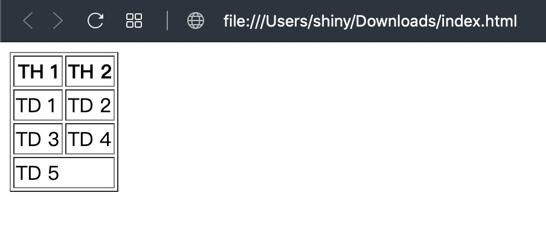

上一篇介紹的項目清單適合簡單快速的分別事物，但是如果需要複雜的比較的時候單純用項目清單可能不是個好選擇，這個時候表格 (`<table>`)就派上用場了，表格就像是 Excel 一樣有橫向與縱向兩個方向來比較東西，具體寫法如下：

```html
<table border="1">
  <thead>
    <tr>
      <th>TH 1</th>
      <th>TH 2</th>
    </tr>
  </thead>
  <tbody>
    <tr>
      <td>TD 1</td>
      <td>TD 2</td>
    </tr>
    <tr>
      <td>TD 3</td>
      <td>TD 4</td>
    </tr>
  </tbody>
  <tfoot>
    <tr>
      <td colspan="2">TD 5</td>
    </tr>
  </tfoot>
</table>
```

表格多了一個屬性 (border)，如果不知道屬性是什麼請參閱 [一分鐘學前端（2）：在 HTML 中加入圖片](https://shinychang.net/blog/一分鐘學前端-2-在-HTML-中加入圖片/)，然後值是 `1` 代表表格的邊框要有 1 個單位的寬度，這邊的單位是只像素，也就是螢幕上的一個點的大小，由於表格預設沒有框線，所以在範例裡面加上了框線讓表格比較清楚的被看到

| 標籤      | 說明                                             |
| --------- | ------------------------------------------------ |
| `<table>` | 表格的容器                                       |
| `<thead>` | 表格的頭，出現在表格的最上面，通常會放欄位的說明 |
| `<tbody>` | 表格的身，出現在表格的中間，通常會放欄位的資料   |
| `<tfoot>` | 表格的腳，出現在表格的最下面，通常會放欄位的總結 |
| `<tr>`    | 表格的列，代表每一行的表格                       |
| `<td>`    | 表格的值                                         |

另外 `<td>` 可以有 `colspan` 這個屬性來做橫向的合併儲存格，而 `<tr>` 也有 `rowspan` 來做直向的合併儲存格

<a href="data:text/text;base64,PCFET0NUWVBFIGh0bWw+CjxodG1sPgogIDxoZWFkPgogICAgPG1ldGEgY2hhcnNldD0idXRmLTgiIC8+CiAgICA8dGl0bGU+5oiR5piv5qiZ6aGMPC90aXRsZT4KICAgIDxsaW5rIHJlbD0ic2hvcnRjdXQgaWNvbiIgaHJlZj0iaWNvbi00OHg0OC5wbmciIC8+CiAgPC9oZWFkPgogIDxib2R5PgogICAgPHRhYmxlIGJvcmRlcj0iMSI+CiAgICAgIDx0aGVhZD4KICAgICAgICA8dHI+CiAgICAgICAgICA8dGg+VEggMTwvdGg+CiAgICAgICAgICA8dGg+VEggMjwvdGg+CiAgICAgICAgPC90cj4KICAgICAgPC90aGVhZD4KICAgICAgPHRib2R5PgogICAgICAgIDx0cj4KICAgICAgICAgIDx0ZD5URCAxPC90ZD4KICAgICAgICAgIDx0ZD5URCAyPC90ZD4KICAgICAgICA8L3RyPgogICAgICAgIDx0cj4KICAgICAgICAgIDx0ZD5URCAzPC90ZD4KICAgICAgICAgIDx0ZD5URCA0PC90ZD4KICAgICAgICA8L3RyPgogICAgICA8L3Rib2R5PgogICAgICA8dGZvb3Q+CiAgICAgICAgPHRyPgogICAgICAgICAgPHRkIGNvbHNwYW49IjIiPlREIDU8L3RkPgogICAgICAgIDwvdHI+CiAgICAgIDwvdGZvb3Q+CiAgICA8L3RhYmxlPgogIDwvYm9keT4KPC9odG1sPg==" download="index.html">下載 HTML</a> 後打開就會看到下圖：



最後附上完整的程式碼：

```html
<!DOCTYPE html>
<html>
  <head>
    <meta charset="utf-8" />
    <title>我是標題</title>
    <link rel="shortcut icon" href="icon-48x48.png" />
  </head>
  <body>
    <table border="1">
      <thead>
        <tr>
          <th>TH 1</th>
          <th>TH 2</th>
        </tr>
      </thead>
      <tbody>
        <tr>
          <td>TD 1</td>
          <td>TD 2</td>
        </tr>
        <tr>
          <td>TD 3</td>
          <td>TD 4</td>
        </tr>
      </tbody>
      <tfoot>
        <tr>
          <td colspan="2">TD 5</td>
        </tr>
      </tfoot>
    </table>
  </body>
</html>
```
