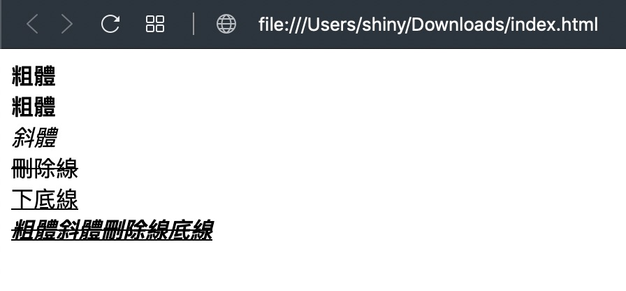

在 [第三篇](https://shinychang.net/blog/一分鐘學前端-3-調整文字大小/) 的時候已經介紹過文字大小的調整了，這次就來介紹一下文字樣式的調整，像是**粗體**、_斜體_、~~刪除線~~與<u>下底線</u>等等的樣式，費話不多說，開始看怎麼作：

```html
<!DOCTYPE html>
<html>
  <head>
    <meta charset="utf-8" />
  </head>
  <body>
    <b>粗體</b><br />
    <strong>粗體</strong><br />
    <i>斜體</i><br />
    <s>刪除線</s><br />
    <u>下底線</u><br />
    <s><i><b><u>粗體斜體刪除線底線</u></b><i></s><br />
  </body>
</html>
```

<a href="data:text/text;base64,PCFET0NUWVBFIGh0bWw+CjxodG1sPgogIDxoZWFkPgogICAgPG1ldGEgY2hhcnNldD0idXRmLTgiIC8+CiAgPC9oZWFkPgogIDxib2R5PgogICAgPGI+57KX6auUPC9iPjxiciAvPgogICAgPHN0cm9uZz7nspfpq5Q8L3N0cm9uZz48YnIgLz4KICAgIDxpPuaWnOmrlDwvaT48YnIgLz4KICAgIDxzPuWIqumZpOe3mjwvcz48YnIgLz4KICAgIDx1PuS4i+W6lee3mjwvdT48YnIgLz4KICAgIDxzPjxpPjxiPjx1Pueyl+mrlOaWnOmrlOWIqumZpOe3muW6lee3mjwvdT48L2I+PGk+PC9zPjxiciAvPgogIDwvYm9keT4KPC9odG1sPg==" download="index.html">下載 HTML</a> 後打開就會看到下圖：



這次用到的 HTML Tag 有 `<b>`, `<strong>`, `<i>`, `<u>` 與 `<s>`，其中 `<u>` 與 `<strong>` 是等價的，HTML 5 後的標準是建議使用 `<strong>` 不過有鑑於瀏覽器必須向前兼容以確保以前的網頁可以正常的顯示，加上 `<u>` 比 `<strong>` 短多了，所以 `<u>` 還是很多人在用。這邊額外附上其他相關的語意化標籤：

| Tag        | 英文          | 說明                               |
| ---------- | ------------- | ---------------------------------- |
| `<u>`      | underline     | 把文字加上下底線                   |
| `<b>`      | bold          | 把文字加上粗體                     |
| `<i>`      | italic        | 把文字加上斜體                     |
| `<s>`      | strikethrough | 把文字加上刪除線                   |
| `<strong>` | strong        | 把文字加上粗體，標示重要的文字     |
| `<em>`     | emphasized    | 把文字加上斜體，強調該文字         |
| `<code>`   | code          | 把文字改成等寬字體，片段程式碼     |
| `<samp>`   | sample output | 把文字改成等寬字體，程式碼輸出結果 |
| `<kbd>`    | keyboard      | 把文字改成等寬字體，鍵盤按鍵       |
| `<var>`    | variable      | 把文字加上斜體，程式碼的變數       |

等寬字體就是每個字元都一樣寬，方便程式碼對齊...
