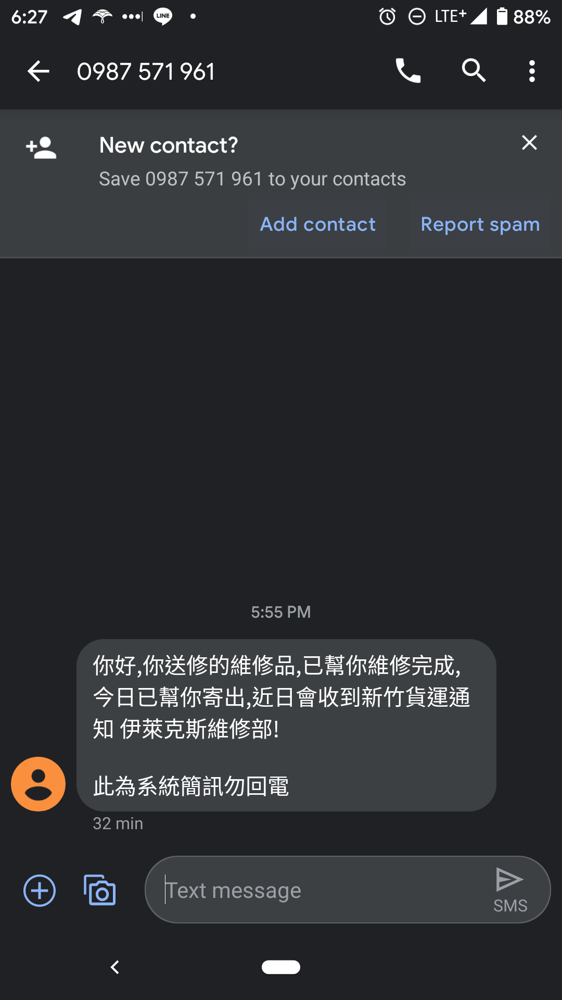
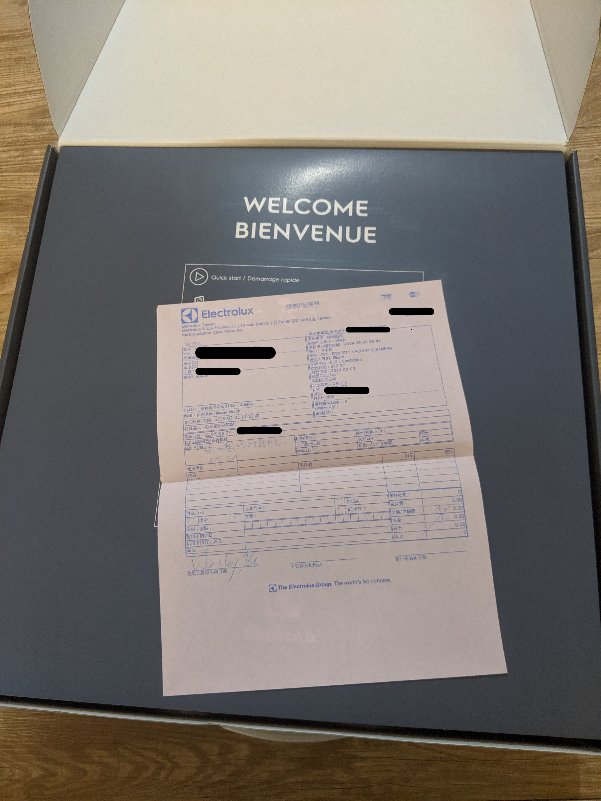
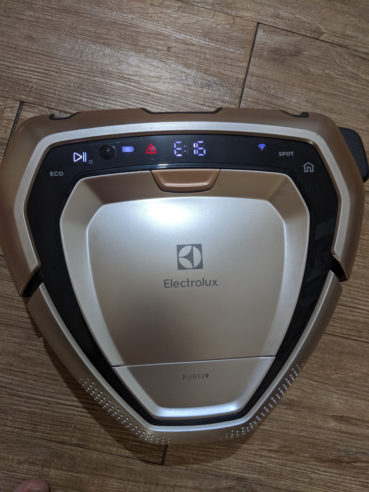

今年二月購入的掃地機器人 Pure i9 在九月的時候突然初現錯誤 E:23 看了說明是電池鬆脫造成的，照著官方的步驟自我排除還是沒有用，所以就報修了

第一次打電話（0800-888259）報修的時候，結果是年度員工教育訓練日，所以沒有任何客服人員可以服務，所以就只好寄信報修（service.tw@electrolux.com），經過了兩天客服就打電話聯絡詢問狀況，確認收件地址，以及送修需要的東西。還好原廠的盒子都還有留著，所以就把 Pure i9 和充電座以及充電線放進盒子裡面等待貨運把他送回去檢修，隔天就有貨運來收走報修的 Pure i9 了。

過了三個工作天候就收到簡訊說已經維修好了

收貨因為颱風的關係，拖延了幾天，收到送修回來的 Pure i9 以後，打開盒子一看，嗯...跟送修的時候一樣有些灰塵，代表他們不會幫你做清潔

送修回來後當然就是要開始工作拉，放下去打掃過一下子就自動要走回家了，後來才發現他是一直在園地打轉

<iframe width="560" height="315" src="https://www.youtube.com/embed/Gc6wnaHr7eo" frameborder="0" allow="accelerometer; autoplay; encrypted-media; gyroscope; picture-in-picture" allowfullscreen></iframe>

有時候就會出現新的錯誤 E:16 ，這個錯誤代表 3D Vision 有問題

但是看了一下，鏡頭還有另外兩個 sensor 都很乾淨，應該不是髒污造成的，所以先把照片影片透過信件傳給原客服又在打電話報修...客服電話蠻有趣的，如果忙線中 30 秒後會自動幫你掛掉，沒有等待的機會

好不容易接通後，重新跟客服講了一次問題，客服要求用乾布清潔 3D Vision 的鏡頭還有另外兩個 sensor 以及集塵盒內部的金屬片，說還是有問題的話在打一次電話報修

送修前已經清潔過了，剛測試就發現問題，進線客服又聽到這種回覆真是讓人賭爛...後來才說重新在送修一次，隔天收貨...

不到一小時原客服打電話來表示已經收到信件且會把照片與影片轉交給維修部的同仁，等收到機器的時候在檢查一次，同時也給予道歉，客服素質還是有差 :/

這一次的檢修真的很久，經過了十三天（含四天連假），終於回來了！打開後看到覺得背版很新，確認一下發現生產序號改變了，代表整個主機板換新的了，也就是說之前維修造成主機板壞掉了...換了新的主機板以後，就一切正常了，整個過程快要一個月，真的是有點辛苦的歷程！
