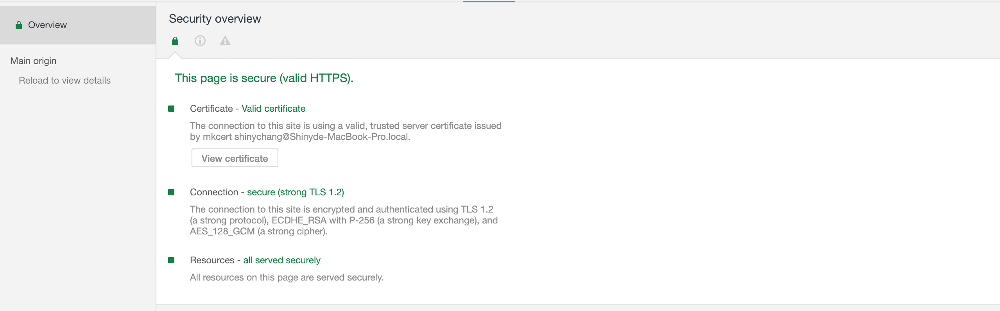
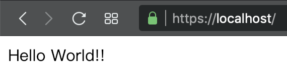

在前一篇文章寫了一些 app 相關的內容，該回到本業（Web）了，現在有許多的 Web APIs（Geolocation, Fullscreen, Service Worker, etc） 都需要在 HTTPS 的情況下才可以使用，為了讓開發更貼近最後上線的結果，在 localhost 使用 HTTPS 是一個好的選擇。



[mkcert](https://github.com/FiloSottile/mkcert) 是一個很好的選擇，他可以幫助我們產生 HTTPS 必要的憑證（root CA, local CA 等），只需要以下三行指令就可以完成 root CA 的產生

```shell
brew install mkcert
brew install nss
mkcert -install
```

接著再輸入需要上 HTTPS 的 domain 名稱即可產生 local CA

```shell
mkcert --cert-file localhost.pem --key-file localhost-key.pem localhost
```

最後再建立 server.js

```javascript
require("dotenv").config()

const https = require("https")
const path = require("path")
const fs = require("fs")
const Express = require("express")

const app = new Express()
app.get("/", (req, res) => res.send("Hello World!!"))

const options = {
  key: fs.readFileSync(path.join(__dirname, "localhost-key.pem")),
  cert: fs.readFileSync(path.join(__dirname, "localhost.pem")),
}
server = https.createServer(options, app)
server.listen(process.env.PORT || 443)
```

就可以打開瀏覽器並且輸入 [https://localhost](https://localhost) 就可以看到以下畫面



最後如果憑證還是有問題的話，可以再輸入以下的指令，讓 Node.js 知道 root CA 在哪裡，就可以解決問題了

```shell
echo "NODE_EXTRA_CA_CERTS=$(mkcert -CAROOT)/rootCA.pem" >> .env
```

當然如果還是覺得太麻煩了的話，可以考慮直接使用 [ngrok](https://ngrok.com/)，什麼 code 都不用改，只需要下一行指令就搞定

```shell
ngrok http 80
```
