首先，開啟瀏覽器，並且輸入網址：https://www.sublimetext.com/ ，到 Sublime Text 的官方網站

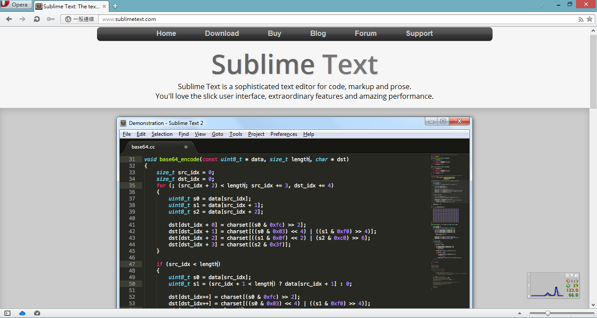

接著往下捲動一點，會看到 **Download for Windows**

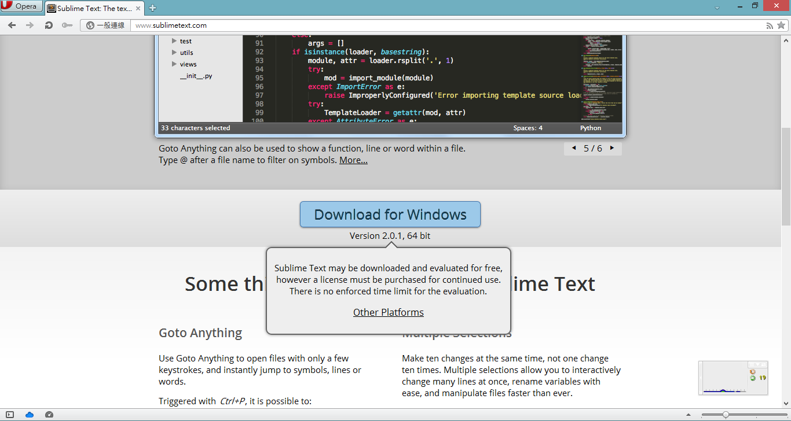

點擊後開始下載 Sublime Text 2

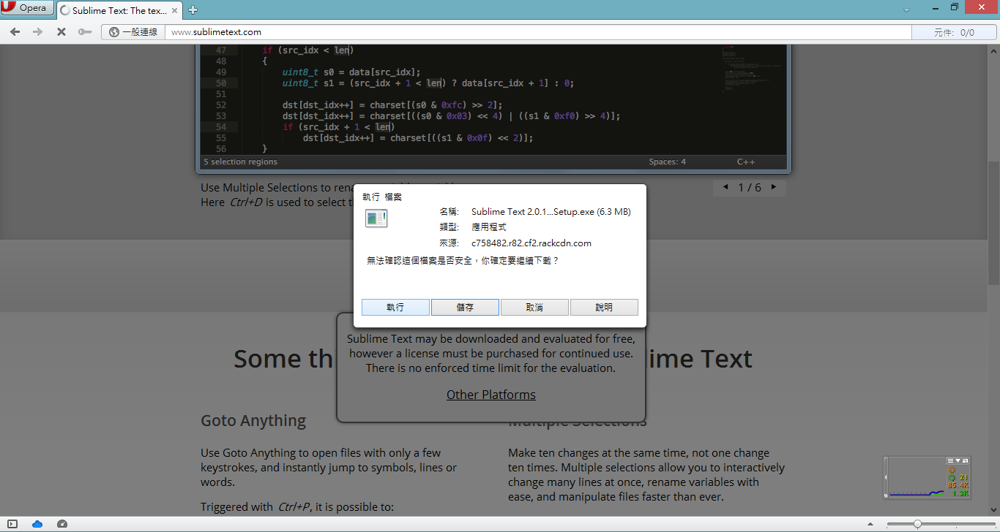

下載完畢過後開始安裝

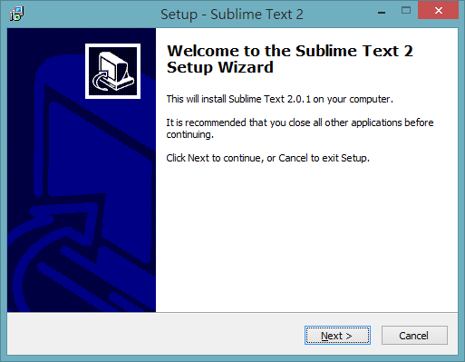

選擇 Next 繼續下一步

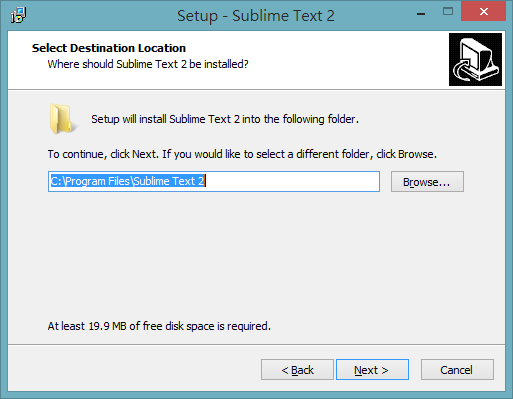

選擇好自己想要的安裝路徑過後按下 Next 下一步

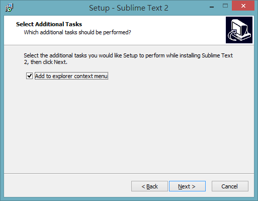

是否要加入右鍵選單，建議勾選，之後開啟檔案會比較方便，選擇完畢過後案 Next 下一步

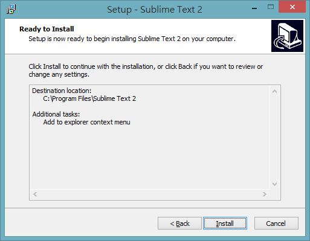

確認安裝，按下 Install 開始安裝

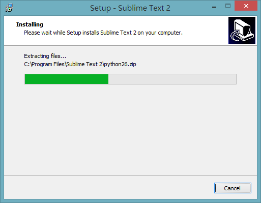

耐心等候安裝（不過通常很快就安裝好了）

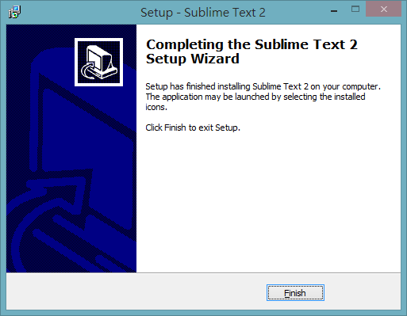

看到完成安裝的畫面了，按下 Finish 完成安裝

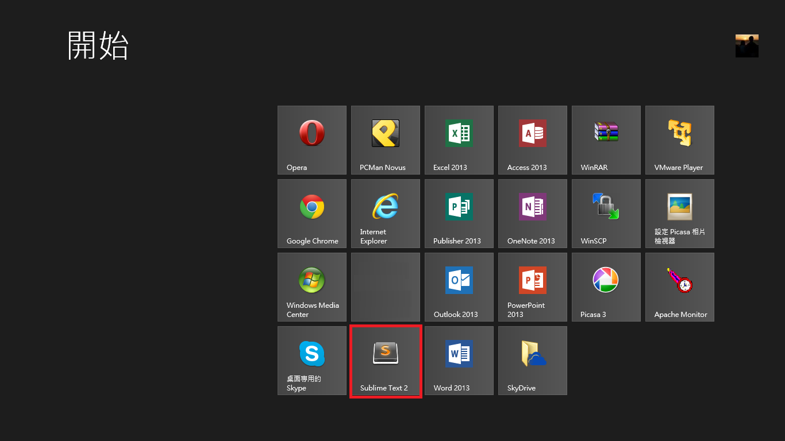

因為我是 Windows 8 的作業系統，因此需要到 Window Style 的介面去執行 Sublime Text 2，如果是 Windows 7, Vista 甚至是 XP，在開始選單裡面都找的到，雙擊就可執行

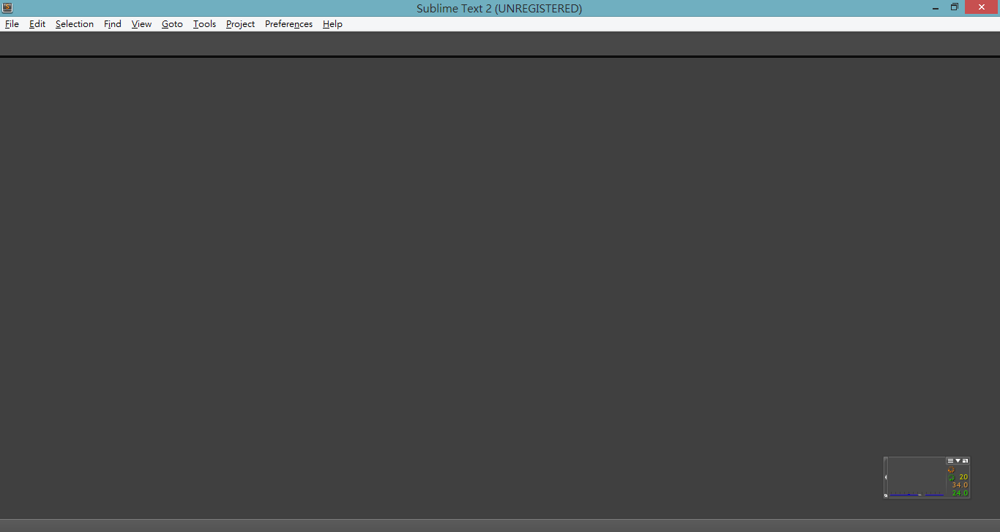
