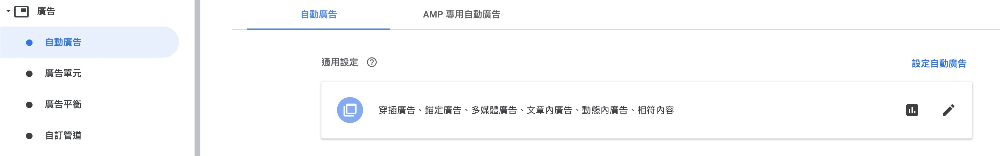
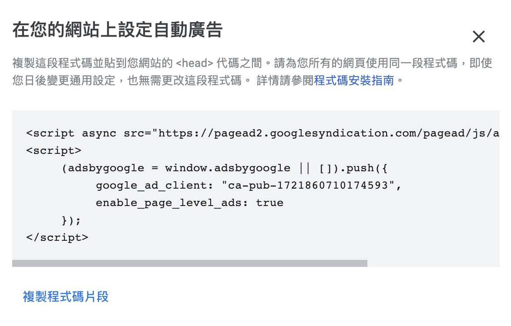

AdSense 是最受歡迎的 blog 廣告服務之一，因為最近剛從 Medium 搬到由 gatsby 自建起來的 blog，所以就放了一下 AdSense 來加減賺一點

## 步驟

1. 在 Google AdSense 上面建立廣告，因為懶的關係，直接選用 AdSense 內建的自動廣告的功能
   

2. 點選右上角的 **設定自動廣告** 並且複製 `google_ad_client` 的內容
   

3. 進入 Gatsby 的資料夾並且輸入以下指令

   ```js
   yarn add gatsby-plugin-google-adsense
   ```

4. 在 `gatsby-config.js` 內的 plugins 清單加入以下資訊，並且把 `publisherId` 修改成在第二步驟的 `google_ad_client` 的內容

   ```js
   module.exports = {
     siteMetadata: {
       ...
     },
     plugins: [
       ...,
       {
         resolve: `gatsby-plugin-google-adsense`,
         options: {
           publisherId: `ca-pub-1721860710174593`,
         },
       },
       ...,
     ],
   }

   ```

5. 然後 `yarn build` 接著 `yarn serve` 在檢查原始碼就可以看到 AdSense 的內容被加上去了
