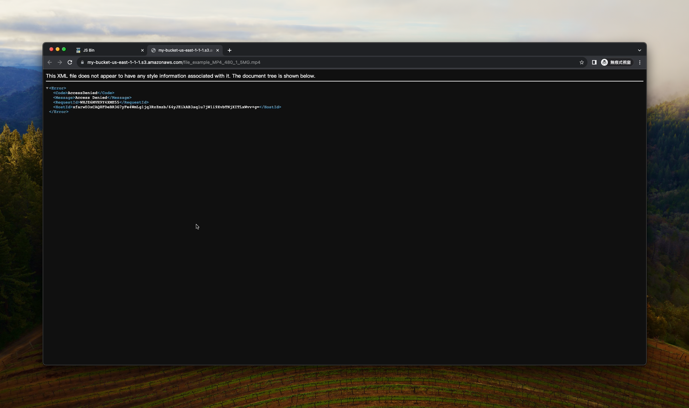
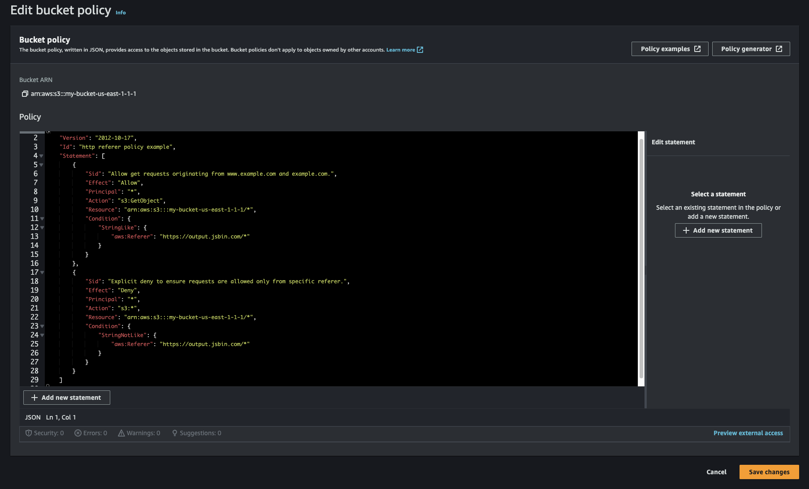
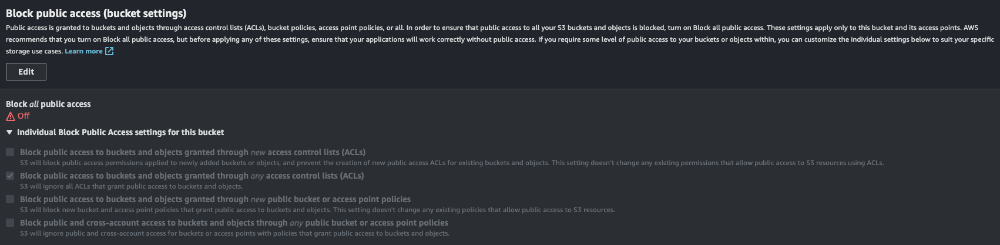
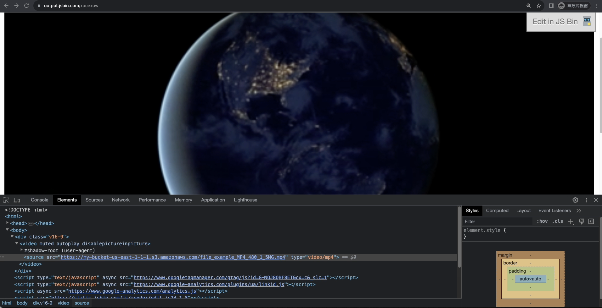

> 免責聲明：此方法只能防止一般的使用者，不能阻擋有網頁知識或是透過專業工具的下載

調整 s3 的 policy 只允許 referer 來自於你自己的 domain，這樣就可以讓直接透過複製網址的方式想要下載影片的人無法下載，結果如下圖



這邊假設你有 AWS S3 的管理權限，這時候就可以進去 AWS console 裡面的 permission 去設定 bucket policy，如下圖



具體的設定文字內容如下：

```
{
 "Version": "2012-10-17",
 "Id": "http referer policy example",
 "Statement": [
  {
   "Sid": "Allow get requests originating from www.example.com and example.com.",
   "Effect": "Allow",
   "Principal": "*",
   "Action": "s3:GetObject",
   "Resource": "arn:aws:s3:::my-bucket-us-east-1-1-1/*",
   "Condition": {
    "StringLike": {
     "aws:Referer": "https://output.jsbin.com/*"
    }
   }
  },
  {
   "Sid": "Explicit deny to ensure requests are allowed only from specific referer.",
   "Effect": "Deny",
   "Principal": "*",
   "Action": "s3:*",
   "Resource": "arn:aws:s3:::my-bucket-us-east-1-1-1/*",
   "Condition": {
    "StringNotLike": {
     "aws:Referer": "https://output.jsbin.com/*"
    }
   }
  }
 ]
}
```

透過以上這些設定，就完成囉

如果還是有問題，可以檢查一下 Block public access (bucket settings) 的設定是否如下圖



最後，影片可以在你的網站上正常播放，但是卻沒辦法直接下載



最後的最後，不要忘記把 video 的 controls 關掉，並且加上 `pointer-events: none;`，因為不知道為什麼，即便都這樣設定了，如果沒有存取過影片的網址，直接點影片右鍵另存影片是可以存檔的 😂

#### References

- https://www.devopsschool.com/blog/prevent-direct-download-of-photos-video-files-from-amazon-s3/
