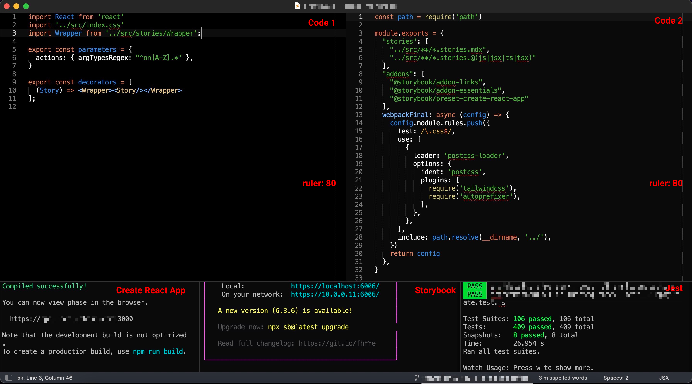

本篇文章會總結這幾年工作下來覺得高效率的開發環境應該有的內容，這邊不會著重在最高效率，而是可以穩定的持續的產出的方式。

1. Macbook

外部環境通常不可控制，譬如說可能要出差到外面或是要到進公司之類的，所以桌機和延伸螢幕就不會是一個穩定的選項。那麼剩下來的就只有一台可以帶著跑得筆電，Macbook Pro 是一個很好的選擇，Mac OS 可以允許直接闔上筆電帶著就走，續航力也不錯，觸控板更是好用，不需要外接滑鼠

2. 熱鍵 (shortcuts)

因為螢幕只有一個，所以熱鍵變成非常重要，需要可以準確的在各個不同視窗或是頁籤中切換甚至是做到到想要的功能，以 Chrome 來說，預設的頁籤是循環頁籤，也就是 `Ctrl + Tab` 的時候會跳到下一個，而不是最近使用的頁籤，但是 Chrome 有提供了 Tab Search 的功能 (`Cmd + Shift + A`) 然後預設會是最近使用的頁籤，所以只要在按下 `Enter` 就可以回到最近使用的頁籤了。另外有時候會需要開無痕或是多使用者情境，就會需要在 Chrome 的視窗間切換，這時候就要用 `` Cmd + ` `` 切換到不同的 Chrome 視窗

3. 視窗管理

前面說的是在單一應用程式裡面的切換，多視窗如果要並排顯示的時候，就需要好的工具來處理，[Rectangle](https://rectangleapp.com/) 就是一個非常強大的工具，可以切一半或是三分之一，甚至是四分之一到螢幕的各種位置，也都提供相對應的熱鍵來操作。而寫程式最重要的編輯器或是 IDE 大部分也都提供了分割視窗的功能，以我最主要在使用的 [Sublime Text](https://www.sublimetext.com/) 來說，是需要安裝 [Origami](https://packagecontrol.io/packages/Origami) 來實現的，下圖就是我最常用的方式

藉由縮小字體和隱藏 minimap 來確保並排顯示的時候左右的區域可以顯示 80 字元，下方的命令列則是透過 [Terminus](https://packagecontrol.io/packages/Terminus) 來實現

4. 通知管理

在專心工作的時候，推播可能會讓你分心，可以使用 Mac OS 內建的勿擾模式或是安裝類似 [NoNotify](https://nonotify.com/) 之類的工具來針對應用程式動態調整。另外可以把 [Slack](https://slack.com/) 當作一個 message hub 來使用，他可以整合 [Google Calendar](https://calendar.google.com/) / [Figma](https://www.figma.com/) / [Miro](https://miro.com/) / [Jira](https://www.atlassian.com/software/jira) 等等工具的留言或是工作狀態更新轉到 Slack 的通知，可在搭配 slackbot 的提醒功能，來去管理優先權，最後每個 Slack channel 都可以產生出一個唯一的 email，可以拿來訂閱各種 service 的 status 更新，當服務出現問題的時候，可以先檢查一下有沒有新的訊息

5. 善用工具

使用頻率越高的應用程式，必須要越熟悉他，盡可能的熟悉他的熱鍵或是使用技巧，同時也要定期的尋找替代產品，看是不是有比目前更好用的應用程式可以使用。另外也要有好的螢幕結圖或錄影軟體，像是 [CleanShot](https://cleanshot.com/) 就是一個超好用的工具，另外前端最常要做得事情就是刻 UI，除了 Figma 和 Devtools 提供給你的間距可以參考之外，也可以在裝 [PixelSnap](https://getpixelsnap.com/) 之類的工具來確保做出來的東西是 pixel-perfect 的

6. 關鍵字記憶與搜尋

因為資訊太過龐大，所以沒辦法記得所有的事情，但是需要訓練自己抓住某些關鍵字，然後在搭配強大的搜尋來找出想要找的內容，以 Chrome 為例，如果你希望當前瀏覽的畫面可以在未來搜尋的到，請先複製網址在貼上並前往一次，之後就可以搜尋的到了，譬如說可以在網址列輸入 `figma design`，搜尋結果裡面就可以出現 `Design System - Figma` 這個你曾經進去過的網頁。

在 Sublime 裡面的話，`Cmd + P` 已經可以滿足大部分的需求，但是我還會另外在安裝 [FuzzyFileNav](https://packagecontrol.io/packages/FuzzyFileNav) 來存取同一資料夾的檔案，操作方式跟命令列非常的像似

7. 備份

轉移設備是一定會發生的，如何快速的在新設備上開始有生產力就變得很重要了，尤其是最重要的編輯器，我會定期的更新與備份整個 Sublime Text 的設定檔到 [GitHub](https://github.com) 的 [Repo](https://github.com/ShinyChang/sublime-user-config) 另外也會維護一份[工具清單](https://github.com/ShinyChang/tools)，幫助我可以快速的安裝各種軟體
